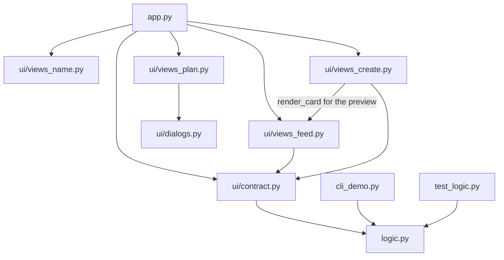
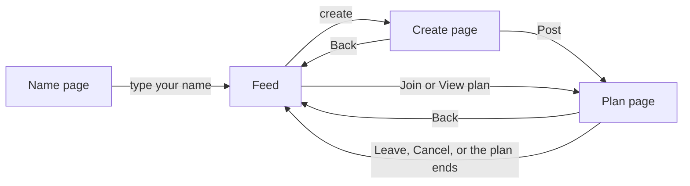

# Join Me (مشينا) — Code Guide

This guide explains **every file, class, method and function** in the project: **what** it does, **why** we need it, and **where** it is used.
The code has short comments; the full explanations live here.

**Contents**

1. [What the app does](#1-what-the-app-does)
2. [How to run it](#2-how-to-run-it)
3. [How Streamlit works (read this first)](#3-how-streamlit-works-read-this-first)
4. [Folder map](#4-folder-map)
5. [How the files connect](#5-how-the-files-connect)
6. [File by file](#6-file-by-file)
7. [Every Streamlit component we use](#7-every-streamlit-component-we-use)
8. [What each browser tab remembers (session_state)](#8-what-each-browser-tab-remembers-session_state)
9. [What happens when you…](#9-what-happens-when-you)
10. [How the code meets the PDF requirements](#10-how-the-code-meets-the-pdf-requirements)
11. [Pseudocode](#11-pseudocode)
12. [Things to watch out for](#12-things-to-watch-out-for)

---

## 1. What the app does

Join Me (مشينا) is a small web app for quick plans at the academy: lunch, studying, work, a discussion, a Tuwaiq talk, or anything else.

- Someone **creates a plan**: a title, a category, a place, "starts in N minutes", how long it lasts, and how many people can come. While typing, they see a **live preview** of the card.
- Other people see it on the **feed** and tap **Join**.
- Everyone sees **who hosts** the plan and **who joined** it.
- At the meeting point, people press **"وصلت المكان"** (I arrived). Their name turns **green** for everyone in the plan.
- When the plan's time is over, it **disappears by itself**.
- There are **no accounts**. You just type a name. Two people can even use the **same name**.

### The screens

| Screen | File | What you see |
|---|---|---|
| Name page | `ui/views_name.py` | The logo and one box: "what should we call you?" |
| Feed (home) | `ui/views_feed.py` | Your name, the "create" button, search, a category dropdown, **your plan on top**, then a card for every other plan (2 per row) |
| Create page | `ui/views_create.py` | The form on one side, a live preview of the card on the other |
| Plan page | `ui/views_plan.py` | The plan you host or joined, a live countdown, the people coming, "I arrived", and Leave or Cancel |
| Pop-ups | `ui/dialogs.py` | "Are you sure?" before leaving or cancelling |

### The rules

Almost all of them live in `logic.py`:

- A plan has three **phases**: `waiting` (before it starts) → `running` (from start to end) → `ended`.
- You can **join** only while it is `waiting`.
- You can **leave**, **cancel** or say **"I arrived"** while it is `waiting` or `running`.
- The **host** (the person who created it) cannot leave. They cancel instead.
- Only the host can cancel. The app checks a **secret host key** that only the host's browser has.
- "I arrived" can be pressed **once** (it can't be undone). If you leave the plan, you are also removed from the "arrived" list.
- A plan stays on the feed while it is waiting, plus **10 more seconds** after it starts. Your **own** plan stays at the top of your feed until it ends.
- Ended plans are deleted.
- Limits: starts in **1–60 minutes**, lasts **5–240 minutes**, **2–12 people** (host included).

Two rules live in the **UI**, not in `logic.py`:

- **One plan at a time.** While you host or joined a plan, the create button is disabled, and other cards say "منضم لخطة ثانية" instead of Join.
- **Same names are allowed.** Every browser gets its own random id (see `me()` in [6.4](#64-uistatepy--what-each-browser-tab-remembers)).

---

## 2. How to run it

**First time on a computer**, install what the project needs:

```powershell
cd meshena
pip install -r requirements.txt
```

**Run the web app:**

```powershell
cd meshena
python -m streamlit run app.py
```

or from the repository folder: `python -m streamlit run meshena/app.py`.
Streamlit reads the theme file `.streamlit/config.toml` from the folder that holds `app.py`, so the colors and font load both ways.
The app opens at **http://localhost:8501**. Press **Ctrl+C** in the terminal to stop it.
Streamlit also prints a **Network URL**: friends on the same Wi-Fi can open it and use the same plans.

**Run the console version** (uses `input()` and `print()`):

```powershell
cd meshena
python cli_demo.py
```

**Run the tests:**

```powershell
cd meshena
python test_logic.py
```

or `python -m pytest test_logic.py` if you have pytest.

**Put it online (Streamlit Community Cloud):** sign in at share.streamlit.io, choose "Create app", pick this GitHub repository and branch, and set the main file path to `meshena/app.py`.

---

## 3. How Streamlit works (read this first)

Streamlit is different from a normal Python program. These ideas explain almost every "strange" line in the code.

### 3.1 The whole script runs again when you use a widget (a "rerun")

When you click a button, press Enter in a text box, or pick an option, Streamlit runs `app.py` again **from the first line to the last** and redraws the page.
That is why `app.py` decides "which screen should I show?" every single time.
The exception: widgets inside a **fragment** or a **pop-up** rerun only that part (see 3.5 and 3.7).

### 3.2 `st.session_state` remembers things for one browser tab

Normal variables are lost at every rerun. `st.session_state` is a dictionary that **survives reruns**.
Each browser tab gets its **own** `session_state`, so it is private to one person. **Refreshing the page starts a new, empty one.**
We store your name, your random id, and the plan you are in. In our code we call it `S` for short (`S = st.session_state` in `ui/state.py`).

### 3.3 `@st.cache_resource` shares one object with everyone

A function marked with `@st.cache_resource` runs **once for each different set of arguments**. After that, every visitor gets **the same saved result**.

- `get_board()` has no arguments, so it runs once in total: **one** `PlanBoard`, and everybody sees the same plans.
- `cover(category, ratio)` runs once per category and ratio, so each picture is cut only once.

> `session_state` = private to one browser tab. `cache_resource` = shared by everyone.

### 3.4 `st.rerun()` starts the script again right now

We call it after we change `session_state` to switch screens, and to close a pop-up.

### 3.5 Fragments refresh part of the page by themselves

A function marked `@st.fragment(run_every=N)` reruns **only itself** every N seconds, without anyone clicking.

| Fragment | Every | Why |
|---|---|---|
| `render_feed` | 10 s | New plans from other people appear, and "starts in N minutes" stays correct |
| `countdown` | 1 s | The clock ticks |
| `participants_panel` | 2 s | New people and green "arrived" names appear quickly |

**Important:** clicking a button **inside** a fragment reruns **only that fragment**, not `app.py`. So a button inside the feed (Join, View plan, Post in the empty box) can't switch the page by itself. It sets `need_rerun = True`, and the feed calls `st.rerun()` for the whole page at its next run.

### 3.6 Widgets, keys and callbacks

- A **widget** is an input: `st.text_input`, `st.button`, `st.selectbox`… It **returns** its value. `st.button` returns `True` only in the rerun right after it was clicked.
- A **key** (`key="..."`) is a unique name for a widget. Streamlit **needs** unique keys when two widgets would otherwise look the same (for example, one Join button on every card). A key also:
  - lets us read or reset the widget's value through `session_state` (the create form does this);
  - adds a CSS class `st-key-<key>` to the element, which `style.css` uses to color it.
- A **callback** (`on_click=some_function`) runs **before** the rerun, as soon as the button is clicked.

### 3.7 Pop-ups

A function marked `@st.dialog("title")` opens as a pop-up window when you call it. Using a widget inside it reruns only the pop-up. Calling `st.rerun()` inside it reruns the whole page and closes it.

### 3.8 A few Python words used in this guide

| Word | Meaning |
|---|---|
| **class, object, `self`** | A class is a blueprint (`Plan`); an object is one thing made from it (one plan). Inside a class, `self` means "this object", so `self.title` is this plan's title. |
| **`__init__`** | The constructor: Python runs it when you write `Plan(...)` or `PlanBoard()`, and it fills in the object's data. |
| **thread** | Like a second worker running the same Python code at the same time. Streamlit uses one for each visitor. |
| **lock** | A "one at a time" sign. `with self.lock:` waits until nobody else is inside, then lets you in. Taking the same lock twice waits forever (the app freezes). |
| **package** | A folder of `.py` files you can import from, like `from ui.state import S`. |
| **lambda** | A tiny function written in one line, like `lambda plan: plan.start_time()`. |
| **list comprehension** | A one-line loop that builds a list: `[p for p in plans if p.category == category]` keeps only the matching plans. |
| **dict comprehension** | The same for dicts: `{arabic: english for english, arabic in CAT_AR.items()}` swaps every pair. |
| **`if __name__ == "__main__":`** | `True` only when you run the file yourself (`python test_logic.py`), not when another tool imports it. |
| **pytest** | A testing tool. It runs every function whose name starts with `test_`. |

---

## 4. Folder map

```text
Group4-Unit1/
└── meshena/
    ├── app.py                  start here: picks which screen to show
    ├── logic.py                the rules (plans, joining, time). No Streamlit.
    ├── cli_demo.py             the same app in the terminal (input / print)
    ├── test_logic.py           automatic tests for logic.py
    ├── requirements.txt        what to install
    ├── .gitignore              files git should not save
    ├── .streamlit/
    │   └── config.toml         the theme: colors, font, rounded corners
    ├── doc/
    │   ├── Code_Guide.md       this guide
    │   ├── CONTRACT.md         the first agreement between the logic and UI teams (Arabic, out of date)
    │   └── Join_Me_Schema.md   the project plan: features and requirements
    └── ui/
        ├── __init__.py         empty: marks "ui" as a package
        ├── contract.py         the one place that imports from logic.py
        ├── state.py            what each browser tab remembers, and who "me" is
        ├── strings.py          every Arabic text + number formatting
        ├── components.py       small shared helpers (logo, icons, pictures, times, CSS)
        ├── views_name.py       the name page
        ├── views_feed.py       the home page (feed) and the plan card
        ├── views_create.py     the create page with the live preview
        ├── views_plan.py       the plan page
        ├── dialogs.py          pop-ups: leave, cancel
        └── assets/
            ├── style.css       a few CSS rules the theme cannot do
            ├── logo_full.png   the logo with the name
            ├── logo_mark.png   the icon only
            └── covers/         one picture per category
```

**Why so many files?** Each file has one job, so it is easy to find things, and two people can work on different files at the same time.
`logic.py` has no Streamlit, so it can be tested on its own and reused by the console version.

---

## 5. How the files connect



`ui/state.py`, `ui/strings.py` and `ui/components.py` are small toolboxes used by almost every `ui` file.

**Moving between screens:**



---

## 6. File by file

Every table below has the same columns:
**What it does** · **Why we need it** · **Where it is used** (which file or function calls it).

### 6.1 `logic.py` — the rules

**Why it exists:** all the rules of Join Me live here, with **no Streamlit**. Because of that, `test_logic.py` can test it, `cli_demo.py` can reuse it, and the web UI just calls it and shows the answers.

Every action returns a message in **English**, like `(True, "You joined")`. The UI shows it in Arabic using `MSG` in `strings.py`.

**Imports**

| Import | Used for |
|---|---|
| `math` | `math.ceil` rounds minutes up |
| `secrets` | makes the random secret host key |
| `threading` | `threading.Lock`, so two people can't change the board at the same moment |
| `datetime`, `timedelta` | the current time, and adding minutes to a time |

**Constants**

| Name | Value | Why we need it | Where it is used |
|---|---|---|---|
| `MIN_START_MIN`, `MAX_START_MIN` | 1, 60 | allowed "starts in" minutes | `validate_input`; the "starts in" box on the create page (through `contract.py`) |
| `MIN_DURATION_MIN`, `MAX_DURATION_MIN` | 5, 240 | allowed plan length | `validate_input` |
| `MIN_CAPACITY`, `MAX_CAPACITY` | 2, 12 | allowed number of people, host included | `validate_input`; the "how many" box on the create page |
| `EXPIRY_GRACE_SECONDS` | 10 | a started plan stays on the feed 10 more seconds, so it doesn't vanish while someone is reading it | `get_active_plans` |
| `CATEGORIES` | `["Lunch", "Study", "Work", "Discussion", "Tuwaiq Talk", "Other"]` | the six categories (English inside the code, Arabic on screen) | `create_plan`; the category dropdowns on the feed and create page |

#### class `Plan` — one plan

**Why we need it:** a plan has many pieces of data (title, place, time, people…) and many questions you can ask it ("has it started?", "is it full?"). A class keeps the data and the questions together.

**Where it is used:** `PlanBoard.create_plan` makes real plans. `views_create.py` makes a temporary one (`Plan(0, ...)`) only to draw the live preview; it is never added to the board.

`Plan.__init__` receives 10 values and stores them. It also sets:

| Attribute | Type | Meaning |
|---|---|---|
| `id` | int | plan number (1, 2, 3…) |
| `title`, `category`, `place`, `description` | str | what the host typed (description can be empty) |
| `host` | str | the person who created it |
| `starts_in_min` | int | minutes from creating until it starts |
| `duration_min` | int | minutes it lasts after it starts |
| `capacity` | int | most people allowed (host included) |
| `host_key` | str | secret code; only the host's browser has it |
| `created_at` | datetime | the moment it was created (set by `__init__`) |
| `attendees` | list of str | people in the plan; **the host is always first** (set by `__init__`) |
| `arrived` | list of str | people who pressed "I arrived"; starts empty (set by `__init__`) |

> In the web app, a "person" is `"name#id"` (for example `"عمر#a1b2c3d4"`), so two people called عمر are different. The logic doesn't care: it just compares strings. See `me()` in [6.4](#64-uistatepy--what-each-browser-tab-remembers).

| Method | Returns | What it does | Why we need it | Where it is used |
|---|---|---|---|---|
| `start_time()` | datetime | `created_at` + `starts_in_min` minutes | we store "minutes", so this turns it into a real time | `ends_at`, `phase`, `get_active_plans`, `time_window` in `components.py` |
| `ends_at()` | datetime | `start_time()` + `duration_min` minutes | to know when the plan is over | `phase`, `seconds_to_end`, `time_window` |
| `phase(now)` | str | `"waiting"`, `"running"` or `"ended"` (`if / elif / else`) | almost every rule depends on the phase. It takes `now` as a parameter so one page uses the same moment everywhere, and tests can pass exact times. | `find_alive`, `join_plan`, `prune_ended_plans`; `render_card_button`, `countdown`, `render_plan_page`; `status` in `cli_demo.py` |
| `seconds_to_start(now)` | int | seconds until the start, never below 0 | the waiting countdown | `minutes_left`, `countdown` |
| `seconds_to_end(now)` | int | seconds until the end, never below 0 | the running countdown | `countdown`, `status` in `cli_demo.py` |
| `minutes_left(now)` | int | minutes until the start, **rounded up** (30 seconds shows "1 minute", not "0") | the "starts in N minutes" badge | `render_card`, `status` in `cli_demo.py` |
| `has_joined(name)` | bool | is this person in `attendees`? A `for` loop; capital letters and extra spaces don't matter | to stop double joins and to know whose plan it is | `get_plan_for_participant`, `join_plan`, `leave_plan`, `mark_arrived`, `render_card_button` |
| `has_arrived(name)` | bool | is this person in `arrived`? Same kind of loop | to color the name green and disable the button | `mark_arrived`, `participants_panel`, `render_arrived_button` |
| `count()` | int | how many people are in it | shown on cards and the plan page | `is_full`, `render_card`, `participants_panel`, `line` in `cli_demo.py` |
| `is_full()` | bool | `True` when `count()` reaches `capacity` | nobody can join a full plan | `join_plan`, `render_card_button` |

#### class `PlanBoard` — all the plans, shared by everyone

**Why we need it:** one place that holds every plan and does every change (create, join, leave…), so the rules are checked the same way every time.

**Where it is used:** `get_board()` in `app.py` makes **one** board for the whole web app. `cli_demo.py` makes its own. Each test makes a fresh one.

`PlanBoard.__init__` starts with:

| Attribute | Meaning |
|---|---|
| `plans` | an empty **dict**: plan id → `Plan` |
| `next_id` | `1`, the id the next plan will get |
| `lock` | a new `threading.Lock` |

**Why the lock?** Streamlit serves every visitor in a separate thread. If two people press Join at the same moment for the last seat, both could get in. `with self.lock:` lets only **one** change happen at a time.

| Method | Returns | What it does | Why we need it | Where it is used |
|---|---|---|---|---|
| `find_alive(plan_id)` | Plan or None | the plan if it exists and has not ended | a shared helper, so every action treats an ended plan as gone. **Call it only inside `with self.lock`**: it doesn't take the lock itself, because taking the same lock twice freezes the app. | `get_plan_for_participant`, `join_plan`, `leave_plan`, `mark_arrived`, `cancel_plan` |
| `validate_input(title, place, host, starts_in_min, duration_min=60, capacity=10)` | list of str | **all** problems with the form, in a fixed order. Empty list = all good. | so the create page can show every problem at once | `create_plan`, `post_plan` in `views_create.py` |
| `create_plan(title, category, place, starts_in_min, description, host, duration_min=60, capacity=10)` | `(ok, message, plan_id, host_key)` | checks the input; an unknown category becomes `"Other"`; makes a random 8-character `host_key`; removes extra spaces; stores the new `Plan` under `next_id` | the only way to add a plan | `post_plan` in `views_create.py`, `post_plan` in `cli_demo.py` |
| `get_active_plans()` | list of Plan | plans not started yet, or started less than 10 seconds ago, **soonest first** with `sorted(..., key=lambda plan: plan.start_time())` — the **lambda** | what the feed shows | `search_plans`, `render_feed`, `cli_demo.py` |
| `search_plans(keyword)` | list of Plan | active plans whose title, place or category contains the keyword (capital letters don't matter; an empty keyword matches all) | the search box | `render_feed`, `cli_demo.py` |
| `get_plan_for_participant(plan_id, name)` | Plan or None | the plan if it is alive **and** this person is in it | the app asks often: "is my plan still alive, and am I still in it?" | `find_my_plan` in `app.py`, `render_feed`, `countdown`, `participants_panel`, `plan_title` in `dialogs.py` |
| `join_plan(plan_id, name)` | `(ok, message)` | checks in this order: empty name → plan missing or started → already joined → full. If all pass, adds the person. | joining | `on_join` in `views_feed.py`, `cli_demo.py` |
| `leave_plan(plan_id, name)` | `(ok, message)` | removes the person from `attendees` **and** `arrived`. The host can't leave. | leaving | `confirm_leave_dialog`, `cli_demo.py` |
| `mark_arrived(plan_id, name)` | `(ok, message)` | checks: plan missing → not in the plan → already arrived. Otherwise adds the person to `arrived`. | the "I arrived" button | `render_arrived_button` in `views_plan.py` |
| `cancel_plan(plan_id, name, host_key)` | `(ok, message)` | deletes the plan, but only if the person is the host **and** the secret key matches | names are not secret; the key is only in the host's browser | `confirm_cancel_dialog`, `cli_demo.py` |
| `prune_ended_plans()` | nothing | deletes every ended plan. It collects the ids first and deletes after the loop, because changing a dict while looping over it crashes. | keeps the board small and clean | `main` in `app.py`, `render_feed`, `cli_demo.py` |
| `rename_person(old, new)` | `(ok, message)` | changes a person everywhere: as host, in `attendees` and in `arrived`. The host key stays the same, so a renamed host can still cancel. | the "change your name" menu | `render_name_menu` in `views_feed.py` |
| `demo_fast_forward(minutes)` | nothing | **tests only**: moves every plan back in time, so "wait 10 minutes" takes 0 seconds | fast tests | `test_logic.py` |

**All the messages** (the UI translates them with `MSG` in `strings.py`):
`Enter your name first`, `Title is required`, `Place is required`, `Start must be between 1 and 60 minutes`, `Duration must be between 5 and 240 minutes`, `Capacity must be between 2 and 50` (see [section 12](#12-things-to-watch-out-for)), `Plan posted`, `You joined`, `You already joined`, `Plan is full`, `Plan not found or expired`, `You left the plan`, `The host cannot leave, cancel instead`, `You are not in this plan`, `You arrived`, `You already arrived`, `Plan cancelled`, `Only the host can cancel`, `Name updated`.

---

### 6.2 `app.py` — the entry point

**Why it exists:** Streamlit starts here (`streamlit run app.py`). On every rerun it sets up the page and decides which screen to draw.

| Function | What it does | Why we need it | Where it is used |
|---|---|---|---|
| `get_board()` | creates the `PlanBoard`. `@st.cache_resource` makes it run **once**. | one board for everyone. Without it, every rerun would make a new, empty board and plans would vanish. | `main` |
| `find_my_plan(board)` | returns the plan I'm in, or `None`. If I had a plan but it's gone (ended or cancelled), it shows a toast and sends me back to the feed with `leave_plan_state()`. It picks the toast from what the countdown saved last (see the `or 99` note in section 12). | so people find out their plan is over | `main` |
| `main()` | 1) tab title, tab icon, wide layout; 2) load the CSS; 3) get the board; 4) no name yet → name page, stop; 5) delete ended plans; 6) show the saved message; 7) find my plan; 8) pick the screen: **plan page** if I'm in a plan and chose to open it, **create page** if I chose "create" and I'm **not** in a plan, otherwise the **feed** | the router of the app | the line `main()` |

`main()` is called on the last code line, because Streamlit runs the file like a script.
At the very end of the file is the **reflection** the PDF asks for, as comments.

---

### 6.3 `ui/contract.py` — the one place that imports the logic

One line: it imports `PlanBoard`, `Plan`, `CATEGORIES` and four limits (`MIN_START_MIN`, `MAX_START_MIN`, `MIN_CAPACITY`, `MAX_CAPACITY`) from `logic.py`.

**Why we need it:** the UI files import the logic **from here**, so if the logic file ever changes name or place, only this one line changes. (At the start of the project the UI used fake logic, and this made the switch to the real one a one-line change.)
`# noqa: F401` tells code checkers "these imports are on purpose".

**Where it is used:** `app.py` (`PlanBoard`), `views_feed.py` (`CATEGORIES`), `views_create.py` (`Plan`, `CATEGORIES` and the limits).

---

### 6.4 `ui/state.py` — what each browser tab remembers

`S = st.session_state` — a short name used everywhere.

| Function | What it does | Why we need it | Where it is used |
|---|---|---|---|
| `viewer()` | my name without extra spaces (`""` if I haven't typed one) | to show my name, and to check "did this person type a name yet?" | `main` in `app.py`, the top bar and name menu, the create page, `me()` |
| `me()` | returns `"name#id"`, for example `"عمر#a1b2c3d4"`. The first time, it makes a random 8-character id with `uuid` and saves it in `S["uid"]`. | **two people can have the same name.** Without an id, a second "عمر" would look like the host and see the host's buttons. With the id, the logic sees two different people. | every place that asks the logic about "me": `find_my_plan`, `render_feed`, `on_join`, `render_card_button`, `render_name_menu`, the create page, the plan page, the dialogs |
| `show_name(person)` | `"عمر#a1b2c3d4"` → `"عمر"` | the id is only for the logic; people should see only the name | `render_card`, `participants_panel`, `render_plan_page` |
| `flash(msg)` | saves a message to show **after** the next rerun | many actions call `st.rerun()` right away, and a toast shown just before a rerun would be lost | `on_join`, `render_name_menu`, `post_plan`, `render_arrived_button`, both dialogs |
| `show_flash()` | shows the saved message as a toast (in Arabic, using `MSG`) and deletes it, so it shows once | the other half of `flash` | `main`, `render_feed` |
| `enter_plan(plan_id, host_key="")` | remembers the plan I'm in, opens the plan page, and clears the countdown memory. Only the host passes a `host_key`. | after joining or creating | `on_join`, `post_plan` |
| `leave_plan_state()` | forgets my plan and goes back to the feed | after leaving, cancelling, or when the plan ends | `find_my_plan`, both dialogs |
| `open_plan_view()` | sets `view = "plan"` and `need_rerun` | callback of the "View plan" button, which is inside the feed fragment (see 3.5) | `render_card_button` |
| `open_feed_view()` | sets `view = "feed"` | callback of the Back buttons | the create page and the plan page |
| `open_create_view()` | sets `view = "create"` and `need_rerun` | callback of the create buttons. The one in the empty feed box is inside the feed fragment, so it needs `need_rerun` too. | the top bar, `render_empty` |

All the keys are listed in [section 8](#8-what-each-browser-tab-remembers-session_state).

---

### 6.5 `ui/strings.py` — every word the user sees

**Why it exists:** all the Arabic text is in one file. You can change the wording without touching the code, and `logic.py` stays in English.

| Name | What it is | Where it is used |
|---|---|---|
| `MSG` | dict: English message from the logic → Arabic text | `show_flash`, the error list on the create page, the empty-name error in the name menu |
| `CAT_AR` | dict: English category → Arabic name (`"Lunch"` → `"غداء"`) | cards, the plan page, both category dropdowns |
| `CAT_EN` | the reverse (Arabic → English), built with a dict comprehension | `render_top_bar`: searching `غداء` finds Lunch plans |
| `T` | dict of every other text, by key (`T["join"]` → `"انضم"`). Some texts have blanks like `{n}` or `{name}` that the code fills with `.format(...)`. The block at the end marked `# added` holds the texts for the new sections, the create-page preview and "I arrived". | every view |
| `AR_DIGITS` | a translation table from 0–9 to ٠–٩ (`str.maketrans`) | `ar` |
| `ar(value)` | writes a number with Arabic digits: `ar(12)` → `"١٢"` | cards, the plan page, `fmt_clock`, `fmt_duration`, `fmt_time` |
| `fmt_clock(seconds)` | the countdown clock: `"mm:ss"`, or `"h:mm:ss"` when an hour or more is left | `countdown` |
| `fmt_duration(minutes)` | a plan length in words: 15 → `١٥ دقيقة`, 60 → `ساعة`, 90 → `ساعة ونص`, 120 → `ساعتين` | the length dropdown on the create page, the plan page |

---

### 6.6 `ui/components.py` — small shared helpers

| Name | What it is | Why we need it | Where it is used |
|---|---|---|---|
| `ASSETS` | the path to `ui/assets`, found from this file's own location | pictures and CSS load no matter which folder you start the app from | `main` (tab icon), `load_css`, `cover` |
| `LOGO`, `LOGO_MARK` | paths to `logo_full.png` (logo with the name) and `logo_mark.png` (icon only) | one place for the logo paths | `LOGO`: the name page and every top bar. `LOGO_MARK`: the empty feed box. |
| `CAT_ICON` | dict: category → Material icon, like `":material/restaurant:"` | each category gets an icon in its badge | `render_card`, `render_plan_page` |
| `load_css()` | adds `assets/style.css` to the page with `st.html` | the few design rules the theme can't do (see 6.12) | `main` |
| `cover(category, ratio=16/9)` | opens the category picture and cuts the top and bottom so it is wider. `@st.cache_resource` cuts each picture once per size. | the pictures are 960×720 (too tall for a card) | `render_card` (16:9), `render_plan_page` (2.2) |
| `fmt_time(moment)` | a clock time in Arabic: 13:05 → `"١:٠٥ م"` (`ص` before noon, `م` after) | to show real clock times | `time_window` |
| `time_window(plan)` | `"start - end"`, like `"١:٠٥ م - ٢:٠٥ م"` | people want to know **when**, not only "in N minutes" | `render_card`, `render_plan_page` |

---

### 6.7 `ui/views_name.py` — the name page

| Function | What it does | Why we need it | Where it is used |
|---|---|---|---|
| `render_name_page()` | the logo; a white card with a heading and a privacy note; a **form** with a name box (max 24 letters) and a button; three violet badges summing up the app | the first screen: we need a name before anything else | `main`, when there is no name yet |

Details:

- **Why a form (`st.form`)?** The name and the button are sent together, and pressing **Enter** counts as pressing the button.
- When submitted, `#` is removed from the name (we use `#` to separate the name from the id), extra spaces are removed, the name is saved in `S["name"]`, and `st.rerun()` opens the feed. An empty name shows `st.error`.

---

### 6.8 `ui/views_feed.py` — the home page and the plan card

| Constant | Meaning |
|---|---|
| `REFRESH_SECONDS = 10` | the feed redraws itself every 10 seconds |
| `COLUMNS = 2` | cards per row on a computer (on a phone they stack) |

| Function | What it does | Why we need it | Where it is used |
|---|---|---|---|
| `render_name_menu(board)` | the button with your name (`st.popover`). It opens a small box to change your name. Save removes `#`, then calls `board.rename_person(old me, new me)` — the id stays the same, only the name changes. | change your name without leaving the page | `render_top_bar` |
| `render_top_bar(board)` | a row with the logo, the name menu and the **create** button (disabled while you are in a plan); the "هلا …" greeting; the **search box** (`live=True`: results update while you type) and the **category dropdown** (its `format_func` is a **lambda** that shows Arabic names). Returns `(keyword, category)`. If the keyword is an Arabic category name, it becomes the English one, because the logic searches English categories. | the top of the feed | `main` |
| `on_join(board, plan_id)` | callback of a Join button: tries to join, saves the message, and on success remembers the plan and sets `need_rerun` | the Join button is inside the feed fragment, so it can't switch the page by itself (see 3.5) | the Join button in `render_card_button` |
| `render_card_button(plan, board, now)` | picks what the bottom of a card shows, with `if / elif / else`: **you are in this plan** (host or joined) → "View plan"; **you are in another plan** → a caption "منضم لخطة ثانية"; **otherwise** → "Join", "Full", or "Join time is over" (disabled when it started or is full) | each person sees the right action. Keys contain `plan.id`, because every card has the same button text and Streamlit needs unique keys. | `render_card` |
| `render_card(plan, board, now, preview=False)` | one plan card: a white bordered box with the picture; badges ("starts in N minutes" in violet or "started" in green, plus the category in grey); the title; host, place and time window; the description; a progress bar "N of M joined · names"; and the button. With `preview=True` it skips the button. | the main building block of the feed | `render_grid`, and the create page's preview |
| `split_into_rows(plans, n)` | cuts the list into rows of `n`: `[first 2, next 2, …]` | Streamlit columns work row by row | `render_grid` |
| `render_grid(plans, board, now)` | for each row, makes `st.columns(2)` and puts one card in each column with `zip` | the two-column layout, used for "my plan" and for the other plans | `render_feed` |
| `render_empty(message)` | a centered white box with the logo icon, a message, and a create button | when there is nothing to show | `render_feed` |
| `render_feed(board, keyword, category)` | **a fragment that reruns every 10 seconds** (see the steps below) | the live list of plans | `main` |

**`render_feed`, step by step:**

1. If a button in this fragment set `need_rerun`, call `st.rerun()` for the whole page.
2. Show the saved message; delete ended plans.
3. **My plan:** if I had a plan but it's gone, rerun the whole page so `app.py` can tell me. Otherwise, show it first, under "خطتي" (if I host it) or "الخطة الي منضم لها" (if I joined it). It stays here even after it started.
4. Get the other plans (search, or all), keep only the chosen category (a list comprehension), and remove my plan so it isn't shown twice.
5. Nothing left → an empty box with "no match" (when searching or filtering), a short note "ما فيه خطط ثانية الحين" (when I have my own plan), or "no plans" (otherwise).
6. Otherwise, a title with the count ("باقي الخطط" when I have a plan, "الخطط المتاحة" when I don't) and the cards.

---

### 6.9 `ui/views_create.py` — the create page

| Constant | Meaning |
|---|---|
| `DURATIONS` | the choices for plan length: 15, 30, 45, 60, 90, 120, 180, 240 minutes |
| `FORM_KEYS` | the keys of the form's inputs, deleted after posting so the form is empty next time |

| Function | What it does | Why we need it | Where it is used |
|---|---|---|---|
| `post_plan(board, title, category, place, wait, description, duration, capacity)` | calls `validate_input` and shows every problem with `st.error`. If there are none: `create_plan` (with `me()` as the host), saves the message, clears the form, `enter_plan(id, host_key)` — **the host key is saved here** — and `st.rerun()` opens the plan page | keeps the button code short and readable | the Post button in `render_create_page` |
| `render_create_page(board)` | the top bar (logo + Back); the heading; **two columns**: <br>• **the form** in a white box: who is creating, category (dropdown), title, place, description, then three side-by-side inputs: starts in (1–60), length (`DURATIONS`, shown in words), how many people (2–12); and the Post button <br>• **the live preview**: a temporary `Plan(0, ...)` made from what you typed (empty fields show "اسم خطتك" / "مكان الخطة"), drawn with the same `render_card` as the feed, without a button | you see exactly how your card will look before posting | `main`, when `view == "create"` and you are not in a plan |

**Why number boxes and a dropdown, not sliders?** On our right-to-left page, Streamlit's sliders can draw the handle on the wrong side. Number boxes and dropdowns always look right.
**Why not `st.form` here?** Inputs outside a form update the page as you type, which is what makes the live preview work.

---

### 6.10 `ui/views_plan.py` — the plan page

| Function | What it does | Why we need it | Where it is used |
|---|---|---|---|
| `countdown(board, plan_id, phase)` | **a fragment that reruns every second.** If the plan is gone, or its phase changed (waiting → running), it reruns the whole page. It saves `last_phase` and `last_secs` (used by `find_my_plan`). Then a big clock (`st.metric`) and a progress bar: while waiting it counts to the start, while running it counts to the end. | a live clock without clicking | `render_plan_page` |
| `participants_panel(board, plan_id)` | **a fragment that reruns every 2 seconds.** A white box: "Participants (2 / 4)", a progress bar, and one row per person: a **green check and a green "وصل" badge** if they arrived, otherwise a violet person icon; a violet "host" badge for the host; a grey "you" badge for you. Then how many seats are left. | everyone sees who is coming and **who is already there** | `render_plan_page` |
| `render_arrived_button(board, plan)` | "وصلت المكان" (green). After you press it, it says "وصلت" and is disabled. It calls `board.mark_arrived`, saves the message and reruns. | tells the others you reached the meeting point | `render_plan_page` |
| `render_plan_page(board, plan)` | the whole page. `role` is `"host"` or `"join"` (comparing `plan.host` with `me()`). `key` is built like `"hero_join_wait"` and picks the right status text from `T` (host or joined × waiting or running). **Top bar:** logo and Back. **Two columns `[3, 2]`:** the wide one has the white plan card (wide picture, status badge, category badge, title, encouragement line, place / time window / length / host, description, countdown), then the **arrived** button, then **Cancel plan** (host, red) or **Leave the plan**. The narrow one has the participants. | the page for the plan you are in | `main`, when you are in a plan and `view == "plan"` |

---

### 6.11 `ui/dialogs.py` — the pop-ups

| Name | What it does | Why we need it | Where it is used |
|---|---|---|---|
| `plan_title(board, plan_id)` | the title of my plan (or `""`) | shown in bold inside the pop-ups | both dialogs |
| `confirm_leave_dialog(board, plan_id)` | "Are you sure you want to leave?" **Stay** (violet, the safe choice) or **Leave**, which calls `board.leave_plan(plan_id, me())`, saves the message, goes back to the feed and reruns | leaving by mistake is annoying; one extra tap prevents it | the "Leave the plan" button on the plan page |
| `confirm_cancel_dialog(board, plan_id)` | the same for cancelling. **Cancel** sends the secret key saved in `S["my_host_key"]` and is red (its key starts with `danger_`) | cancelling deletes the plan for everyone | the "Cancel plan" button on the plan page |

---

### 6.12 `ui/assets/style.css` — the few rules the theme can't do

**Why it exists:** Streamlit has no right-to-left setting, and the theme can't color one specific box. Everything else (colors, font, corners) is in `config.toml`.

| Rule | What it does | Why |
|---|---|---|
| `.stApp, [data-testid="stDialog"], … { direction: rtl; }` | the page, pop-ups, toasts and the name menu read right to left | Arabic |
| `[data-testid="stElementContainer"], input, textarea { text-align: right; }` | text starts on the right | Streamlit aligns left by default |
| `[data-testid="stHeader"] { display: none; }` | hides Streamlit's top bar | a cleaner page |
| `[data-testid="stMainBlockContainer"] { max-width: 1100px; … }` | the page is at most 1100 px wide | lines don't get too long on big screens |
| `[data-testid="stElementToolbar"] { display: none; }` | hides the "fullscreen" button on pictures | not needed |
| `[data-testid="InputInstructions"] { display: none; }` | hides "Press Enter to submit" and the letter counter | cleaner text boxes |
| `[data-testid="stHeaderActionElements"] { display: none; }` | hides the **link icon** that appears next to headings on hover | not needed, and it looked broken |
| `[class*="st-key-card_"], .st-key-name_card, … .st-key-form_card` | white background and a soft shadow | Streamlit's boxes are see-through; `key="card_3"` gives the class `st-key-card_3` |
| `[class*="st-key-card_"]:hover` | a violet glow when the mouse is over a card | shows it is interactive |
| `[data-testid="stImage"] img { border-radius: 12px; }` | rounded pictures | matches the rounded cards |
| `[class*="st-key-danger_"] button` | red text and border | Streamlit has no red button type, so any button whose key starts with `danger_` is red |
| `.st-key-arrived_btn button` (and `:disabled`) | the arrived button is green; after pressing, light green | green = "I'm here" |

**Two warnings:**

- **Never type a less-than sign in this file.** `st.html` throws away the whole stylesheet if it sees something that looks like an HTML tag.
- The `data-testid` names come from Streamlit. After upgrading Streamlit, check the app still looks right.

---

### 6.13 `.streamlit/config.toml` — the theme

**Why it exists:** most of the design comes from here, without any CSS. After editing it, refresh the browser; if the colors still look old, restart the app.

| Option | Value | What it controls |
|---|---|---|
| `base` | `"light"` | start from Streamlit's light theme |
| `primaryColor` | `#512ABA` | the brand violet: main buttons, progress bars, focused boxes |
| `backgroundColor` | `#F7F6FB` | the page background |
| `secondaryBackgroundColor` | `#F0EBFC` | the background of input boxes |
| `textColor` | `#1F1A33` | normal text |
| `borderColor` | `#E4DFF3` | borders around cards |
| `violetColor` | `#512ABA` | the violet used by `color="violet"` badges and `:violet[...]` text |
| `redColor` | `#C0392B` | the red used by error boxes |
| `font` | IBM Plex Sans Arabic | loaded from Google Fonts; supports Arabic and English |
| `baseRadius` | `0.75rem` | how round the corners are |
| `buttonRadius` | `"full"` | pill-shaped buttons |
| `showWidgetBorder` | `false` | input boxes have no border, just a light background |
| `headingFontWeights`, `headingFontSizes` | lists | weight and size of headings `#` to `######` |
| `metricValueFontWeight` | `700` | the countdown clock is bold |
| `[client] toolbarMode` | `"minimal"` | hides Streamlit's menu |

---

### 6.14 `ui/assets/` pictures

| File | Used for |
|---|---|
| `logo_full.png` | the logo with the name: the name page and every top bar |
| `logo_mark.png` | the icon only: the browser tab icon and the empty feed box |
| `covers/*.png` | one picture per category. The file name is the category in lower case with `_` for spaces (`Tuwaiq Talk` → `tuwaiq_talk.png`). `cover()` builds this name, so **a new category needs a picture with the matching name**. |

---

### 6.15 `cli_demo.py` — the app in the terminal

**Why it exists:** the PDF asks for `input()` and `print()`. This is the same app in the terminal, using the same `logic.py`. It has its **own** board (it doesn't share plans with the web app) and uses plain names (no ids).

| Name | What it does | Where it is used |
|---|---|---|
| `line` | a **lambda**: turns a plan into one line of text (id, title, place, category, status, people, who arrived) | `show_plans` |
| `status(plan)` | `"starts in N min"`, `"running, N min left"` or `"ended"` (`if / elif / else`) | `line` |
| `ask_number(text, low, high, default)` | asks for a whole number in a range with a `while True` loop until the answer is valid. Empty answer = the default. Returns an int. | `post_plan`, `main` |
| `show_plans(plans)` | prints each plan with `line`, or "No plans right now." | `main` |
| `post_plan(board, name, keys)` | asks for every field with `input()` (the allowed ranges come from the limits in `logic.py`, so they always match), creates the plan, and keeps its host key in the `keys` dict (plan id → key) so you can cancel later | `main` |
| `main()` | asks your name once, then shows the menu again and again (`while True`): 1 Post, 2 Show, 3 Search, 4 Join, 5 Leave, 6 Cancel, 7 I arrived, 8 Exit. An `if / elif / else` chain picks the action; `break` exits. | the last line of the file |

---

### 6.16 `test_logic.py` — the automatic tests

**Why it exists:** it checks the rules in `logic.py`, so a change that breaks a rule is caught right away. Each test uses `assert`: if the condition is false, the test fails. To "wait" without waiting, the tests call `demo_fast_forward(minutes)`.

| Name | What it checks |
|---|---|
| `new_board()` | helper: a board with one plan ("Lunch", starts in 10 min, lasts 30 min, 3 seats, host Ali). Returns the board, the plan and its key. |
| `phase(plan)` | helper: the plan's phase right now |
| `test_validate` | good input has no errors; bad input gets all six errors in order; values above the limits are refused |
| `test_create` | spaces removed, an unknown category becomes "Other", the host is first, the key has 8 characters, ids go up by one |
| `test_phases` | waiting → running → ended at exactly the right moments |
| `test_listing_and_grace` | soonest first; a started plan stays for the 10-second grace, then disappears |
| `test_search` | search by title, place and category, any capital letters; empty search = all |
| `test_join` | joining, double join, empty name, missing plan, full plan, too late |
| `test_leave` | not in it, host can't leave, leaving while running, too late after it ends |
| `test_arrived` | only people in the plan can arrive; once only; capital letters don't matter; renaming keeps you "arrived"; leaving removes you |
| `test_cancel` | wrong name or key is refused; the host with the key can cancel, also while running |
| `test_participant_lookup` | finds my plan only if I'm in it and it hasn't ended |
| `test_prune` | only ended plans are deleted |
| `test_rename` | the new name replaces the old one everywhere, and the key still works |
| `test_no_deadlock` | after calling the methods that use the lock, the lock is free (a method that took it twice would freeze) |

The block at the bottom (`if __name__ == "__main__":`) runs every `test_` function and prints `PASS` for each, so `python test_logic.py` works without pytest.

---

### 6.17 The other files

| File | What it is |
|---|---|
| `requirements.txt` | `streamlit>=1.65`. Streamlit Cloud installs this. Pillow (used by `cover()`) comes with Streamlit. |
| `.gitignore` | tells git not to save `__pycache__/` folders and `.pyc` files (Python's cache) |
| `ui/__init__.py` | an empty file that marks `ui` as a package |
| `doc/Join_Me_Schema.md` | the project plan: overview, features, user requirements, data model |
| `doc/CONTRACT.md` | the first agreement (in Arabic) between the logic team and the UI team. **Out of date** (old limits, old return values, no host key, no "arrived"). Trust `logic.py`. |

---

## 7. Every Streamlit component we use

| Component | What it is | Where we use it | Why |
|---|---|---|---|
| `st.set_page_config` | tab title, tab icon, page layout | `main` | a proper browser tab and a wide page |
| `@st.cache_resource` | run once per set of arguments, share the result with everyone | `get_board`, `cover` | one shared board; cut each picture once |
| `st.session_state` | a dict that survives reruns, one per browser tab | `ui/state.py` (as `S`) and the views | remember your name, id, plan and messages |
| `st.rerun` | run the script again now | many places | switch screens, close pop-ups |
| `@st.fragment(run_every=…)` | a part of the page that reruns by itself | `render_feed`, `countdown`, `participants_panel` | live updates without clicking |
| `@st.dialog` | a pop-up window | `ui/dialogs.py` | "are you sure?" |
| `st.popover` | a button that opens a small box | the name menu | change your name in place |
| `st.container` | a box that groups elements. `border=True` draws a frame; `horizontal=True` puts children side by side; `horizontal_alignment` / `vertical_alignment` line them up; `gap`, `width`, `height` set spacing and size; `key` gives a CSS class | everywhere | cards, top bars, centering |
| `st.columns` | side-by-side columns (they stack on phones) | the feed grid, the create page, the plan page, the form inputs, the pop-up buttons | layout |
| `st.space` | empty space; `"stretch"` takes all the free space | name page, top bars, cards | push things apart or down |
| `st.image` | shows a picture | logos, covers | pictures |
| `st.markdown` | formatted text: `##` heading, `**bold**`, `:material/icon:` an icon, `:violet[…]` / `:green[…]` colored text | headings, titles, participants | text with style |
| `st.caption` | small grey text | subtitles, host / place / time, notes | less important text |
| `st.write` | shows text | descriptions, pop-up questions | simple text |
| `st.badge` | a small colored label with an optional icon | times, categories, status, "host", "you", "وصل" | quick facts at a glance |
| `st.progress` | a progress bar, optionally with text | seats taken, countdown | "how full" and "how long" |
| `st.metric` | a label with a big value | the countdown clock | big, easy-to-read time |
| `st.toast` | a small message in the corner that disappears | `show_flash`, `find_my_plan` | "You joined", "Plan posted"… |
| `st.error` | a red message box | the name page, the create page, the name menu | show what is wrong |
| `st.form` + `st.form_submit_button` | inputs sent together when you press the button (or Enter) | the name page | Enter counts as pressing the button |
| `st.text_input` | a one-line text box (`placeholder`, `max_chars`, `icon`, `label_visibility`, `value`, `live`, `key`) | name, search, rename, title, place | typing |
| `st.text_area` | a multi-line text box | description | longer text |
| `st.number_input` | a number box with − and + | "starts in", "how many people" | numbers within limits |
| `st.selectbox` | a drop-down list (`format_func` changes what is shown, not the value) | the category filter, the category and length on the create page | pick one choice |
| `st.button` | a button (`type="primary"`, `icon`, `width="stretch"`, `disabled`, `key`, `on_click` + `args`) | everywhere | actions |
| `st.html` | adds raw HTML/CSS | `load_css` | our stylesheet |

---

## 8. What each browser tab remembers (`session_state`)

| Key | Set by | Meaning |
|---|---|---|
| `name` | the name page, the name menu | your name as you typed it |
| `uid` | `me()` (the first time it is called) | your random 8-character id, so people with the same name are different |
| `my_plan_id` | `enter_plan`, `leave_plan_state` | the id of the plan you are in, or `None` |
| `my_host_key` | `enter_plan`, `leave_plan_state` | the secret key if you host the plan, `""` otherwise |
| `view` | `enter_plan`, `leave_plan_state`, `open_plan_view`, `open_feed_view`, `open_create_view` | `"feed"`, `"create"` or `"plan"` |
| `last_phase`, `last_secs` | `countdown` (reset by `enter_plan`) | the plan's last phase and the seconds until it ends; `find_my_plan` uses them to choose the toast |
| `flash` | `flash()` | a message to show as a toast after the next rerun |
| `need_rerun` | `on_join`, `open_plan_view`, `open_create_view` | asks the feed fragment for a whole-page rerun |
| `c_title`, `c_category`, `c_place`, `c_description`, `c_wait`, `c_duration`, `c_capacity` | the create page's inputs (their keys) | the form values; deleted after posting |

---

## 9. What happens when you…

**Open the app for the first time**
`main()` → no name → `render_name_page()` → you type a name and press Enter → `S["name"]` → `st.rerun()` → the feed.

**Create a plan**
The create button → `open_create_view()` → `view = "create"` → `main()` shows `render_create_page` → you type, and the preview updates → Post → `post_plan` → `validate_input` (errors are shown, if any) → `create_plan(..., me(), ...)` → `flash("Plan posted")` → `enter_plan(id, host_key)` → `st.rerun()` → the plan page, with the toast "نزلت خطتك".

**Join a plan**
Join → the callback `on_join` runs first: `join_plan(id, me())` → message saved → `enter_plan(id)` → `need_rerun = True` → the feed fragment reruns, sees `need_rerun`, calls `st.rerun()` → the plan page.

**Someone with the same name opens the app**
Their browser gets a different `uid`, so `me()` is different (`"عمر#…"` vs `"عمر#…"`). On your plan's card they see **Join**, not "View plan", and they never see your Cancel button. If they join, the plan has two people called عمر, and each one sees "انت" only on their own row.

**Someone joins your plan**
Their browser changes the shared board. Your participants box refreshes every 2 seconds and shows them.

**Someone presses "I arrived"**
`render_arrived_button` → `mark_arrived(id, me())` → their name is added to `plan.arrived` → in every browser on the plan page, the participants box (every 2 seconds) shows their name with a green check and a green "وصل" badge.

**Your plan starts**
The countdown sees the phase change → `st.rerun()` → the plan page shows the "started" texts and counts down to the end. On the feed, it stays at the top under "خطتي" until it ends; for other people it disappears 10 seconds after it starts.

**Your plan ends**
The countdown finds no plan any more → `st.rerun()` → `main()` deletes ended plans → `find_my_plan` shows a toast → back to the feed.

**The host cancels**
Cancel → confirm → `cancel_plan(id, me(), host key)` → deleted → back to the feed. People in it: on the plan page their countdown notices within 1 second; on the feed, the feed notices within 10 seconds. Either way they see "الخطة خلصت او انلغت" and land on the feed.

**You leave**
Leave → confirm → `leave_plan(id, me())` → you are removed from the people and the "arrived" list → `leave_plan_state()` → the feed.

**You change your name**
Name menu → Save → `rename_person(old me, new me)` changes it in every plan (as host, in the people list and in the arrived list) → `S["name"]` → `st.rerun()`. Your id stays the same.

**You search or filter**
The search box and the category dropdown are outside the feed fragment, so changing them reruns the whole page → `render_feed` uses `search_plans` and keeps only the chosen category.

---

## 10. How the code meets the PDF requirements

| Requirement | Where in the code |
|---|---|
| **At least 3 data types** | `str` (titles, names), `int` (minutes, ids, capacity), `float` (`16 / 9`, progress values), `bool` (`ok`, `is_full()`, `has_joined()`, `has_arrived()`), `list` (`attendees`, `arrived`, errors), `dict` (`plans`, `T`, `MSG`), `tuple` (`(ok, message)`), `datetime` |
| **Collections** | the `plans` dict; the `attendees` and `arrived` lists; the `keys` dict in `cli_demo.py`; the tuples the methods return |
| **if / elif / else** | `Plan.phase`, `join_plan`, `leave_plan`, `mark_arrived`, `cancel_plan`, `main` in `app.py`, `render_card_button`, `render_feed`, `status` and `main` in `cli_demo.py` |
| **Loops** | `for` in `has_joined`, `has_arrived`, `search_plans`, `prune_ended_plans`, `rename_person`, `render_grid`, `participants_panel`, `post_plan`; `while True` in `ask_number` and the console menu |
| **A function with parameters and a return value** | for example `Plan.phase(now)` → str, `PlanBoard.search_plans(keyword)` → list, `fmt_time(moment)` → str, `show_name(person)` → str, `ask_number(text, low, high, default)` → int |
| **A lambda** | `sorted(visible, key=lambda plan: plan.start_time())` in `get_active_plans`; `line = lambda p: ...` in `cli_demo.py`; `format_func=lambda c: ...` in both category dropdowns |
| **input()** | `cli_demo.py`. In the web app the same job is done by `st.text_input`, `st.number_input`, `st.selectbox` and `st.button`. |
| **print()** | `cli_demo.py` and `test_logic.py`. In the web app: `st.markdown`, `st.write`, `st.caption`, `st.badge`, `st.metric`, `st.toast`. |
| **Comments** | a one-line comment above every class and method in `logic.py`, and short comments in the UI files where the code isn't obvious |
| **Plan your logic with pseudocode** | [section 11](#11-pseudocode) |
| **Deployment** | Streamlit Community Cloud, main file `meshena/app.py` (see [section 2](#2-how-to-run-it)) |
| **Reflection** | at the end of `app.py` (a draft: the team should rewrite it in their own words) |

---

## 11. Pseudocode

**`app.py`** (runs on every rerun):

```text
load the CSS and get the one shared board
no name yet?                                   -> show the name page, stop
delete ended plans, show the saved message (toast)
am I in a plan and did I choose to open it?    -> plan page
did I choose "create" and I'm not in a plan?   -> create page
otherwise                                      -> the feed: top bar, my plan, the other plans
```

**Who am I? (`me()`)**

```text
if this browser has no id yet -> make a random one and remember it
return "my name#my id"
on screen, only show the part before "#"
```

**Joining a plan (`join_plan`)**:

```text
if the name is empty             -> "Enter your name first"
elif the plan is gone or started -> "Plan not found or expired"
elif I'm already in it           -> "You already joined"
elif it is full                  -> "Plan is full"
else                             -> add me -> "You joined"
```

**"I arrived" (`mark_arrived`)**:

```text
if the plan is gone          -> "Plan not found or expired"
elif I'm not in the plan     -> "You are not in this plan"
elif I already arrived       -> "You already arrived"
else                         -> add me to "arrived" -> "You arrived"
```

**`cli_demo.py`**:

```text
ask for my name once
keep showing the menu until I choose Exit:
    post / show / search / join / leave / cancel
    ask with input(), call the board, print the message it returns
```

---

## 12. Things to watch out for

- **`style.css`: never type a less-than sign.** It silently turns off the whole stylesheet (see 6.12).
- **What needs a restart.** Changes to the `ui` files and `style.css` show up when you refresh the browser. Changes to **`logic.py` need a restart** (Ctrl+C, then run again), because the shared board was created from the old code and `@st.cache_resource` keeps it.
- **Streamlit 1.65 or newer is required** (`requirements.txt` already says so).
- **Everything is in memory.** Restarting the app deletes all plans. This is on purpose: plans are short-lived and no personal data is stored.
- **Refreshing the page makes you a new person.** `session_state` is emptied, so you get a **new id**. You type your name again, you are no longer in your old plan (your old seat stays taken until the plan ends), and **a host can no longer view or cancel their plan**. Don't refresh while you are in a plan.
- **`#` can't be in a name.** The name page and the name menu remove it, because `#` separates the name from the id.
- **"I arrived" can't be undone.** That is on purpose, to keep it simple. Leaving the plan removes you from the list.
- **The "plan is over" toast rarely shows.** In `find_my_plan`, `(S.get("last_secs") or 99) <= 3` turns a saved `0` into `99` (Python treats 0 as false), so people usually see "الخطة خلصت او انلغت" instead of "خلصت الخطة". One-line fix: `secs = S.get("last_secs")` then `ended = S.get("last_phase") == "running" and secs is not None and secs <= 3`.
- **The capacity message doesn't match the limit.** `logic.py` allows up to 12 people but its message says "between 2 and 50", and `strings.py` has a key for "2 and 10", so the message would show in English. Nobody can see it today (the web form and `cli_demo.py` both stop at 12), but to fix it, change together: the message in `logic.py`, a matching key in `strings.py`, and the expected text in `test_logic.py`.
- **`doc/CONTRACT.md` is out of date.** Trust `logic.py`.
