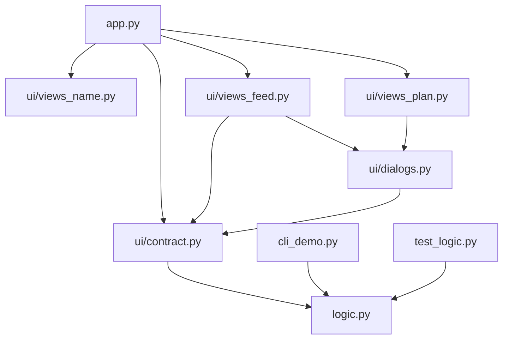
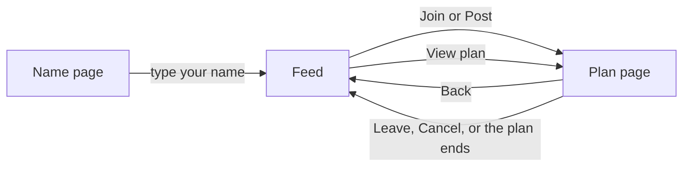

# Join Me (مشينا) — Code Guide

This guide explains **every file, every function, and every Streamlit component** in the project, and **why** each one exists.
The code has only a few short comments on purpose: the full explanations live here.

**Contents**

1. [What the app does](#1-what-the-app-does)
2. [How to run it](#2-how-to-run-it)
3. [How Streamlit works (read this first)](#3-how-streamlit-works-read-this-first)
4. [Folder map](#4-folder-map)
5. [How the files connect](#5-how-the-files-connect)
6. [File by file](#6-file-by-file)
7. [Every Streamlit component we use](#7-every-streamlit-component-we-use)
8. [What each browser tab remembers (session_state)](#8-what-each-browser-tab-remembers-session_state)
9. [What happens when you…](#9-what-happens-when-you)
10. [How the code meets the PDF requirements](#10-how-the-code-meets-the-pdf-requirements)
11. [Pseudocode](#11-pseudocode)
12. [Things to watch out for](#12-things-to-watch-out-for)

---

## 1. What the app does

Join Me (مشينا) is a small web app for quick plans at the academy: lunch, studying, work, a discussion, a Tuwaiq talk, or anything else.

- Someone **posts a plan**: a title, a category, a place, "starts in N minutes", how long it lasts, and how many people can come.
- Other people see it in the **feed** and tap **Join**.
- On the feed, everyone sees **how many** people joined and **who hosts** the plan. Once you are in a plan, you see **everyone who is coming**.
- When the plan's time is over, it **disappears by itself**.
- There are **no accounts**. You just type a name.

### The screens

| Screen | File | What you see |
|---|---|---|
| Name page | `ui/views_name.py` | The logo and one box: "what should we call you?" |
| Feed (home) | `ui/views_feed.py` | Search, your name, "Post a plan", category chips, and a card for every plan |
| Plan page | `ui/views_plan.py` | The plan you joined or host, a live countdown, and the people coming |
| Pop-ups | `ui/dialogs.py` | The "post a plan" form, and "are you sure?" for leaving or cancelling |

### The rules (almost all of them live in `logic.py`)

- A plan has three **phases**: `waiting` (before it starts) → `running` (from start to end) → `ended`.
- You can **join** only while it is `waiting`.
- You can **leave** or **cancel** while it is `waiting` or `running`.
- The **host** (the person who posted) cannot leave. They cancel instead.
- A plan stays in the feed while it is waiting, plus **10 more seconds** after it starts, then it leaves the feed. (The feed redraws every 10 seconds, so on someone's screen it can stay up to about 20 seconds.) People inside it still see their plan page until it ends.
- Ended plans are deleted.
- Limits: starts in **1–60 minutes**, lasts **5–240 minutes**, **2–12 people** (host included).
- In the web app, a person can be in **one plan at a time**. This rule is **not** in `logic.py`: the UI enforces it by disabling Join and Post while you are in a plan, so it applies to each browser tab. The console version has no such limit.

---

## 2. How to run it

**First time on a computer**, install what the project needs:

```powershell
cd meshena
pip install -r requirements.txt
```

**Run the web app** (either way works):

```powershell
cd meshena
python -m streamlit run app.py
```

```powershell
python -m streamlit run meshena/app.py
```

Streamlit reads the theme file `.streamlit/config.toml` from the folder that holds `app.py`, so the colors and font load in both cases.
The app opens at **http://localhost:8501**. Press **Ctrl+C** in the terminal to stop it.
When it starts, Streamlit also prints a **Network URL**: friends on the same Wi-Fi can open it and use the same plans.

**Run the console version** (uses `input()` and `print()`):

```powershell
cd meshena
python cli_demo.py
```

**Run the tests:**

```powershell
cd meshena
python test_logic.py
```

or `python -m pytest test_logic.py` if you have pytest (see [3.8](#38-a-few-python-words-used-in-this-guide)).

**Put it online (Streamlit Community Cloud):** sign in at share.streamlit.io, choose "Create app", pick this GitHub repository and branch, and set the main file path to `meshena/app.py`.

---

## 3. How Streamlit works (read this first)

Streamlit is different from a normal Python program. These ideas explain almost every "strange" line in the code.

### 3.1 The whole script runs again when you use a widget (a "rerun")

When you use a widget — click a button, press Enter in a text box, pick an option — Streamlit normally runs `app.py` again **from the first line to the last**, and redraws the page.
That is why `app.py` decides "which screen should I show?" every single time.
The exception: widgets inside a **fragment** or a **pop-up** rerun only that part (see 3.5 and 3.7).

### 3.2 `st.session_state` remembers things for one browser tab

Normal variables are lost at every rerun. `st.session_state` is a dictionary that **survives reruns**.
Each browser tab gets its **own** `session_state`, so it is private to one person. **Refreshing the page starts a new, empty one.**
We store things like your name and the plan you are in. In our code we call it `S` for short (`S = st.session_state` in `ui/state.py`).

### 3.3 `@st.cache_resource` shares one object with everyone

A function marked with `@st.cache_resource` runs **once for each different set of arguments**. After that, every visitor gets **the same saved result**.

- `get_board()` has no arguments, so it runs once in total: **one** `PlanBoard`, so everybody sees the same plans.
- `cover(category, ratio)` runs once per category and ratio.

The saved result is kept until the server restarts, or until the function's own code is changed.

> `session_state` = private to one browser tab. `cache_resource` = shared by everyone.

### 3.4 `st.rerun()` starts the script again right now

We call it after we change `session_state` to switch screens, and to close a pop-up.

### 3.5 Fragments refresh part of the page by themselves

A function marked `@st.fragment(run_every=N)` reruns **only itself** every N seconds, without anyone clicking.
We use three:

| Fragment | Every | Why |
|---|---|---|
| `render_feed` | 10 s | New plans from other people appear, and "starts in N minutes" stays correct |
| `countdown` | 1 s | The clock ticks |
| `participants_panel` | 3 s | New people who join appear |

Also: when you use a widget **inside** a fragment (for example the category chips, or the Join button on a card), only that fragment reruns, not the whole page. That is why the code sometimes asks for a full `st.rerun()` to switch screens.

### 3.6 Widgets, keys and callbacks

- A **widget** is an input: `st.text_input`, `st.button`, `st.pills`… It **returns** its value. `st.button` returns `True` only in the rerun right after it was clicked.
- A **key** (`key="..."`) is a unique name for a widget. Streamlit **needs** unique keys when two widgets would otherwise look the same (for example, one "Join" button on every card). A key also:
  - lets us read or reset the widget's value through `session_state`;
  - adds a CSS class `st-key-<key>` to the element, which `style.css` uses to color it.
- A **callback** (`on_click=some_function`) runs **before** the rerun, as soon as the button is clicked.

### 3.7 Pop-ups

A function marked `@st.dialog("title")` opens as a pop-up window when you call it. Using a widget inside it reruns only the pop-up. Calling `st.rerun()` inside it reruns the whole page and closes it.

### 3.8 A few Python words used in this guide

| Word | Meaning |
|---|---|
| **class, object, `self`** | A class is a blueprint (`Plan`); an object is one thing made from it (one plan). Inside a class, `self` means "this object", so `self.title` is this plan's title. |
| **`__init__`** | The constructor: Python runs it when you write `Plan(...)` or `PlanBoard()`, and it fills in the object's data. |
| **thread** | Like a second worker running the same Python code at the same time. Streamlit uses one for each visitor. |
| **lock** | A "one at a time" sign. `with self.lock:` waits until nobody else is inside, then lets you in. Taking the same lock twice waits forever (the app freezes). |
| **package** | A folder of `.py` files you can import from, like `from ui.state import S`. |
| **dict comprehension** | A one-line loop that builds a new dict. `{arabic: english for english, arabic in CAT_AR.items()}` takes every (English, Arabic) pair and swaps it. |
| **list comprehension** | The same for lists: `[p for p in plans if p.category == category]` keeps only the matching plans. |
| **`if __name__ == "__main__":`** | `True` only when you run the file yourself (`python test_logic.py`), not when another tool imports it. |
| **pytest** | A popular testing tool. It imports a test file and runs every function whose name starts with `test_`. |

---

## 4. Folder map

```text
Group4-Unit1/
└── meshena/
    ├── app.py                  start here: picks which screen to show
    ├── logic.py                the rules (plans, joining, time). No Streamlit.
    ├── cli_demo.py             the same app in the terminal (input / print)
    ├── test_logic.py           automatic tests for logic.py
    ├── requirements.txt        what to install
    ├── .gitignore              files git should not save
    ├── .streamlit/
    │   └── config.toml         the theme: colors, font, rounded corners
    ├── doc/
    │   ├── Code_Guide.md       this guide
    │   ├── CONTRACT.md         the first agreement between the logic team and the UI team (Arabic, out of date)
    │   └── Join_Me_Schema.md   the project plan: features and requirements
    └── ui/
        ├── __init__.py         empty: marks "ui" as a package
        ├── contract.py         the one place that imports the logic
        ├── state.py            what each browser tab remembers
        ├── strings.py          every Arabic text + number and time formatting
        ├── components.py       small shared helpers (logo, icons, pictures, CSS)
        ├── views_name.py       the name page
        ├── views_feed.py       the home page (feed)
        ├── views_plan.py       the plan page
        ├── dialogs.py          pop-ups: post, leave, cancel
        ├── dummy_logic.py      old fake logic, not used any more
        └── assets/
            ├── style.css       a few CSS rules the theme cannot do
            ├── logo.png, logo_full.png, logo_mark.png
            └── covers/         one picture per category
```

**Why so many files?** Each file has one job, so it is easy to find things.
The logic team and the UI team could work at the same time.
`logic.py` has no Streamlit, so it can be tested on its own and reused by the console version.

---

## 5. How the files connect



`ui/state.py`, `ui/strings.py` and `ui/components.py` are small toolboxes used by almost every `ui` file.

**Moving between screens:**



---

## 6. File by file

### 6.1 `logic.py` — the rules

**Why it exists:** the rules of Join Me live here, with **no Streamlit** (the one exception, "one plan at a time", is enforced by the UI). Because of that:

1. `test_logic.py` can test it;
2. `cli_demo.py` can reuse it;
3. the UI calls these functions and shows the answers.

Every method that returns a message returns it in **English**. The UI translates it to Arabic (see `MSG` in `strings.py`).

**Imports**

| Import | Used for |
|---|---|
| `math` | `math.ceil` rounds minutes up |
| `secrets` | makes the random secret host key |
| `threading` | `threading.Lock`, so two people can't change the board at the same moment |
| `datetime`, `timedelta` | the current time and adding minutes |

**Constants**

| Name | Value | Meaning |
|---|---|---|
| `MIN_START_MIN`, `MAX_START_MIN` | 1, 60 | allowed "starts in" minutes |
| `MIN_DURATION_MIN`, `MAX_DURATION_MIN` | 5, 240 | how long a plan lasts after it starts |
| `MIN_CAPACITY`, `MAX_CAPACITY` | 2, 12 | allowed number of people (capacity), host included |
| `EXPIRY_GRACE_SECONDS` | 10 | a started plan stays in the feed 10 more seconds, so it doesn't vanish while someone is reading it |
| `CATEGORIES` | `["Lunch", "Study", "Work", "Discussion", "Tuwaiq Talk", "Other"]` | the six categories (English; the UI shows Arabic) |

#### class `Plan` — one plan

`Plan.__init__` (the constructor, see 3.8) is called by `PlanBoard.create_plan` with 10 values. It stores them, and it also sets `created_at` to the current time and `attendees` to a list holding only the host.

| Attribute | Type | Meaning |
|---|---|---|
| `id` | int | plan number (1, 2, 3…) |
| `title`, `category`, `place`, `description` | str | what the host typed (description can be empty) |
| `host` | str | the name of the person who posted |
| `starts_in_min` | int | minutes from posting until it starts |
| `duration_min` | int | minutes it lasts after it starts |
| `capacity` | int | most people allowed (host included) |
| `host_key` | str | secret code; only the host's browser tab has it |
| `created_at` | datetime | the moment it was posted |
| `attendees` | list of str | names of people in it; **the host is always first** |

**Why store minutes instead of a clock time?** It is simple: the start is always `created_at + starts_in_min`.

| Method | Returns | What it does and why |
|---|---|---|
| `start_time()` | datetime | `created_at` + `starts_in_min` minutes |
| `ends_at()` | datetime | `start_time()` + `duration_min` minutes |
| `phase(now)` | str | `"waiting"` before the start, `"running"` until the end, `"ended"` after (`if / elif / else`). It takes `now` as a parameter so the whole page uses the same moment, and tests can pass exact times. |
| `seconds_to_start(now)` | int | seconds until the start, never below 0. Used by the countdown. |
| `seconds_to_end(now)` | int | seconds until the end, never below 0 (rounded down) |
| `minutes_left(now)` | int | minutes until the start, **rounded up**, so 30 seconds shows "1 minute", not "0" |
| `has_joined(name)` | bool | is this name in the plan? Loops over `attendees`. Ignores capital letters and extra spaces ("sara" = "Sara"). |
| `count()` | int | how many people are in it |
| `is_full()` | bool | `True` when `count()` reaches `capacity` |

#### class `PlanBoard` — all the plans, shared by everyone

`PlanBoard.__init__` starts with:

| Attribute | Meaning |
|---|---|
| `plans` | an empty **dict**: plan id → `Plan` |
| `next_id` | `1`, the id the next plan will get |
| `lock` | a new `threading.Lock` |

**Why the lock?** Streamlit serves every visitor in a separate thread (see 3.8). If two people press "Join" at the same moment for the last seat, both could get in. `with self.lock:` lets only **one** change happen at a time.

| Method | Returns | What it does and why |
|---|---|---|
| `find_alive(plan_id)` | Plan or None | the plan if it exists and has not ended (an ended plan counts as gone even before it is deleted). A helper for the other methods. **Only call it inside `with self.lock`**: it reads `plans` without taking the lock itself, because every method that calls it already holds the lock, and taking the same lock twice would freeze the app. |
| `validate_input(title, place, host, starts_in_min, duration_min=60, capacity=10)` | list of str | **all** problems with the form, in a fixed order. Empty list = everything is fine. The UI calls it first so it can show every problem at once. |
| `create_plan(title, category, place, starts_in_min, description, host, duration_min=60, capacity=10)` | `(ok, message, plan_id, host_key)` | checks the input; an unknown category becomes `"Other"`; makes a random 8-character `host_key` (like `"a3f9c21e"`); removes extra spaces; stores the new `Plan` under `next_id`. On failure: `(False, first problem, None, "")`. |
| `get_active_plans()` | list of Plan | the plans the feed shows: not started yet, or started less than 10 seconds ago. Sorted **soonest first** with `sorted(..., key=lambda plan: plan.start_time())` — this is the **lambda**. |
| `search_plans(keyword)` | list of Plan | active plans whose title, place or category contains the keyword. Capital letters don't matter. An empty keyword matches everything. |
| `get_plan_for_participant(plan_id, name)` | Plan or None | the plan if it is waiting or running **and** this name is in it. The plan page asks this every second: "is my plan still alive, and am I still in it?" |
| `join_plan(plan_id, name)` | `(ok, message)` | checks, in this order: empty name → plan missing or already started → already joined → full. If all pass, adds the name. |
| `leave_plan(plan_id, name)` | `(ok, message)` | removes the person. The host can't leave. Works while waiting or running. |
| `cancel_plan(plan_id, name, host_key)` | `(ok, message)` | deletes the plan, but only if the **name and the secret key** both match. Names are not secret (anyone could type "Sara"); the key is only in the host's browser tab. |
| `prune_ended_plans()` | nothing | deletes every ended plan. It collects the ids first and deletes after the loop, because changing a dict while looping over it crashes. |
| `rename_person(old, new)` | `(ok, message)` | changes a name everywhere: as host and in every attendee list. The host key does not change, so a renamed host can still cancel. |
| `demo_fast_forward(minutes)` | nothing | **for tests only**: moves every plan back in time, so "wait 10 minutes" takes 0 seconds |

**All the messages.** The UI shows them in Arabic using `MSG` in `strings.py`, except `Capacity must be between 2 and 50` (see [section 12](#12-things-to-watch-out-for)):
`Enter your name first`, `Title is required`, `Place is required`, `Start must be between 1 and 60 minutes`, `Duration must be between 5 and 240 minutes`, `Capacity must be between 2 and 50`, `Plan posted`, `You joined`, `You already joined`, `Plan is full`, `Plan not found or expired`, `You left the plan`, `The host cannot leave, cancel instead`, `You are not in this plan`, `Plan cancelled`, `Only the host can cancel`, `Name updated`.

---

### 6.2 `app.py` — the entry point

**Why it exists:** Streamlit starts here (`streamlit run app.py`). On every rerun it sets up the page and decides which screen to draw.

| Function | What it does and why |
|---|---|
| `get_board()` | creates the `PlanBoard`. `@st.cache_resource` makes it run **once**, so there is one board for everyone. Without it, every rerun would make a new, empty board and plans would vanish instantly. |
| `find_my_plan(board)` | returns the plan I am in, or `None`. If I had a plan but it's gone, it shows a toast and sends me back to the feed (`leave_plan_state()`). To choose the toast it looks at what the countdown saved last: the idea is "the plan was running with 3 seconds or less left → it ended by itself → خلصت الخطة; otherwise → الخطة خلصت او انلغت (ended or cancelled)". Careful: `or 99` replaces any "empty" value with 99 — `None` (nothing saved) **and also `0`**, because Python treats 0 as false. The countdown's last saved value is usually 0, so in practice you usually see "الخطة خلصت او انلغت" (see section 12). |
| `main()` | 1) `st.set_page_config`: tab title, tab icon, wide layout. 2) `load_css()`. 3) get the shared board. 4) No name yet → name page, stop. 5) Delete ended plans. 6) Show the saved message, if any. 7) Find my plan. 8) In a plan **and** `view == "plan"` → plan page; otherwise → top bar + feed. |

The last line, `main()`, runs it. Streamlit runs the file like a script, so `main()` must be called.

---

### 6.3 `ui/contract.py` — the switch between fake and real logic

One import: `PlanBoard`, `CATEGORIES` and four limits (`MIN_START_MIN`, `MAX_START_MIN`, `MIN_CAPACITY`, `MAX_CAPACITY`) come from `logic.py`. The UI files that need them (`app.py`, `views_feed.py`, `dialogs.py`) import them **from here**. The duration limits and the grace time are not passed on (the UI doesn't need them).

**Why:** at the start, `logic.py` wasn't ready, so the UI used fake logic (`ui/dummy_logic.py`). Because the UI imports from `contract.py`, switching to the real logic was a one-line change.
`# noqa: F401` tells code checkers "these imports are on purpose" (they are passed on to other files).

---

### 6.4 `ui/state.py` — what each browser tab remembers

`S = st.session_state` (a short name used everywhere).

| Function | What it does and why |
|---|---|
| `viewer()` | my name without extra spaces (`""` if I haven't typed one). Used everywhere to ask "who is looking?" |
| `flash(msg)` | saves a message to show **after** the next rerun. Many actions call `st.rerun()` right away, and a toast shown just before a rerun would be lost. |
| `show_flash()` | if a message is saved, shows it as a toast (in Arabic, using `MSG`) and deletes it, so it shows once |
| `enter_plan(plan_id, host_key="")` | remembers the plan I'm in, opens the plan page, and clears the countdown memory. Only the host passes a `host_key`. |
| `leave_plan_state()` | forgets my plan and goes back to the feed |
| `open_plan_view()` | callback of the "View plan" button. It also sets `need_rerun`, because that button is inside the feed fragment (see 3.5). |
| `open_feed_view()` | callback of the "Back" button |

All the keys are listed in [section 8](#8-what-each-browser-tab-remembers-session_state).

---

### 6.5 `ui/strings.py` — every word the user sees

**Why:** all the Arabic text is in one file. You can change the wording without touching the code, and `logic.py` stays in English.

| Name | What it is |
|---|---|
| `MSG` | dict: English message from the logic → Arabic text |
| `CAT_AR` | dict: English category → Arabic name (`"Lunch"` → `"غداء"`) |
| `CAT_EN` | the reverse (Arabic → English), built with a dict comprehension (see 3.8). Lets people search `غداء` and find Lunch plans. |
| `T` | dict of every other text, by key (`T["join"]` → `"انضم"`). Some texts have blanks like `{n}`, `{cap}`, `{name}` that the code fills with `.format(...)`. The last group of keys (from `feat_post` to `f_description_hint`) holds the texts added for the new design. |
| `AR_DIGITS` | a translation table from 0–9 to Arabic digits ٠–٩ (made with `str.maketrans`) |
| `ar(value)` | writes a number with Arabic digits: `ar(12)` → `"١٢"` |
| `fmt_clock(seconds)` | the countdown clock: `"mm:ss"`, or `"h:mm:ss"` when an hour or more is left, with Arabic digits |
| `fmt_duration(minutes)` | a plan length in words: 15 → `١٥ دقيقة`, 60 → `ساعة`, 90 → `ساعة ونص`, 120 → `ساعتين`, 180 → `٣ ساعات`, 75 → `ساعة و١٥ دقيقة` |

---

### 6.6 `ui/components.py` — small shared helpers

| Name | What it is and why |
|---|---|
| `ASSETS` | the path to the `ui/assets` folder, found from this file's own location, so pictures load no matter where you start the app |
| `LOGO`, `LOGO_MARK` | paths to `logo_full.png` (logo with the name) and `logo_mark.png` (the icon only) |
| `CAT_ICON` | dict: category → a Material icon, like `":material/restaurant:"`. Streamlit draws `:material/name:` as an icon (names from fonts.google.com/icons). |
| `load_css()` | adds `assets/style.css` to the page with `st.html`. When you give `st.html` a `pathlib.Path` to a `.css` file (`ASSETS / "style.css"` is a Path), Streamlit wraps it in a style tag and it takes no space on the page. A plain string like `"ui/assets/style.css"` would be shown as text instead. |
| `category_label(category)` | the text shown for a category chip: icon + Arabic name, or `الكل` for `"All"`. Used as `format_func` for `st.pills` (the feed filter and the post form). It changes what is **shown**, not the value you get back. |
| `cover(category, ratio=16/9)` | opens the category picture and cuts equal parts off the top and bottom so it is wider (the pictures are 960×720, which is too tall for a card). `@st.cache_resource` remembers the result for each (category, ratio) pair, so each picture is cut once per size. Cards and the "my plan" banner use 16:9; the plan page uses 2.2. |

---

### 6.7 `ui/views_name.py` — the name page

`render_name_page()` draws the first screen:

1. `st.space("large")` — some space at the top.
2. A container with `horizontal_alignment="center"` — everything inside is centered.
3. `st.image(LOGO, width=220)` — the logo.
4. `st.container(border=True, key="name_card", width=440)` — the card. Its key gives it the CSS class that makes it white.
5. `st.markdown("### ...")` — the heading; `st.caption(...)` — the small grey privacy note.
6. `st.form("name_form")` — **why a form:** the name and the button are sent together. Pressing **Enter** in the box counts as pressing the button, and clicking somewhere else does not rerun the app. Without a form, Enter would rerun the app but the button would not count as pressed, so Enter alone would do nothing.
   - `st.text_input` with a person icon, max 24 letters, the label hidden (the placeholder "مثلا رند" is enough).
   - `st.form_submit_button` — full width, with an arrow. `icon_position="right"` puts the arrow after the text, which is the left side in Arabic, pointing forward.
7. When submitted: the name (without extra spaces) is saved in `S["name"]` and `st.rerun()` runs the app again. Now `main()` sees a name and shows the feed. An empty name shows `st.error`.
8. Three violet `st.badge`s at the bottom sum up the app in a few words each (post your plan, join others, starts within minutes).

---

### 6.8 `ui/views_feed.py` — the home page

| Constant | Meaning |
|---|---|
| `REFRESH_SECONDS = 10` | the feed redraws itself every 10 seconds |
| `COLUMNS = 3` | cards per row on a computer (on a phone they stack) |

| Function | What it does and why |
|---|---|
| `render_name_menu(board)` | the button with your name (`st.popover`). It opens a small box with a name field (already filled in) and a Save button. Save calls `board.rename_person`, updates `S["name"]`, saves a message, and reruns. An empty name shows an error. |
| `render_top_bar(board)` | a horizontal row: logo, search box, name menu, and the "Post a plan" button. Then the "هلا …" greeting and a caption. **Search** uses `live=True`, so results update as you type (after a short pause, no Enter needed). The **Post** button is disabled while you are in a plan (one plan at a time) and opens `post_dialog`. It returns the search word; if the word is exactly an Arabic category name, it becomes the English name, because the logic searches English categories. |
| `render_category_filter()` | the category chips (`st.pills`). `required=True` means one chip is always selected. Shows icons + Arabic using `category_label`. Returns `None` for "All". |
| `on_join(board, plan_id)` | callback of a Join button: tries to join, saves the message, and on success remembers the plan and sets `need_rerun` so the whole page switches to the plan page. |
| `render_card_button(plan, board, now)` | picks the one button a card shows, with `if / elif / else`: **host** → red "Cancel plan" (key starts with `danger_`, which `style.css` colors red) → asks to confirm; **member** → "Leave" → asks to confirm; **everyone else** → "Join", "Full", or "Join time is over". Join is disabled when the plan started, is full, or you are already in a plan. The keys contain `plan.id` because every card has the same button text, and Streamlit needs unique keys. |
| `render_card(plan, board, now)` | one plan card: a bordered container (key `card_<id>` → white via CSS) with `height="stretch"`, so all cards in a row are the same height. Inside: the picture; badges ("starts in N minutes" in purple, or "started" in green, plus the category in grey); the title; place and length with icons; the description; `st.space("stretch")`, which pushes the rest down so the buttons line up; a progress bar (people / capacity) with "N of M joined · with Host"; and the button. |
| `render_my_plan(plan, now)` | the light-purple banner at the top when you are in a plan: picture, role badge ("you host this" / "you joined"), title, place and status, a note that you must leave to join another plan, and the "View plan" button. |
| `split_into_rows(plans, n)` | cuts the list into rows of `n`: `[first 3, next 3, …]`. Streamlit columns work row by row, and rows keep the soonest-first order when a phone stacks them. |
| `render_empty(board, message)` | when there are no plans: a centered box with the logo, the message, and a "Post a plan" button |
| `render_feed(board, keyword)` | **a fragment that reruns every 10 seconds.** Steps: 1) if `need_rerun` was set (by `on_join` or by the View plan button's `open_plan_view`), call `st.rerun()` for the whole page — those buttons are inside this fragment, so their click reran only the fragment and `app.py` never got to show the plan page (see 3.5); 2) show the saved message; 3) delete ended plans; 4) if I had a plan but it's gone, rerun the whole page so `app.py` can tell me; otherwise show my banner; 5) the category chips; 6) get the plans (search, or all), then keep only the chosen category (a list comprehension, see 3.8); 7) nothing left → the empty box; 8) the title with the count, then the cards: for each row, `st.columns(3)`, and `zip` puts one card in each column. |

---

### 6.9 `ui/views_plan.py` — the plan page

| Function | What it does and why |
|---|---|
| `countdown(board, plan_id, phase)` | **a fragment that reruns every second.** If the plan is gone, or its phase changed (waiting → running), it reruns the whole page so the right texts or the "plan is over" message appear. It saves `last_phase` and `last_secs` (used by `find_my_plan` in `app.py`). Then it shows `st.metric` (label + big clock) and a progress bar that fills up as time passes. While waiting it counts to the start; while running it counts to the end. |
| `participants_panel(board, plan_id)` | **a fragment that reruns every 3 seconds.** A white box: "Participants (2 / 4)", a progress bar, and one row per person (icon and name; the host's row also has a violet "host" badge, and your own row a grey "you" badge). If seats remain, it says how many. |
| `render_plan_page(board, plan)` | the whole page. `role` is `"host"` or `"join"`. `key` is built like `"hero_join_wait"` and picks the right status text from `T` (4 combinations: host or joined × waiting or running); `T[key + "_sub"]` is the line under the title. **Top bar:** logo, `st.space("stretch")` to push the Back button to the other side, and Back (the arrow points right, which is "back" in Arabic). **Two columns `[3, 2]`:** the wider one has the white plan card (wide picture, status badge — purple hourglass while waiting, green "play" while running — category badge, title, encouragement line, place / length / host, description, countdown), and under it **Cancel plan** (host, red) or **Leave the plan**. The narrow one has the participants. On a phone, the two columns stack. |

---

### 6.10 `ui/dialogs.py` — the pop-ups

| Name | What it is and why |
|---|---|
| `DURATIONS` | the choices for plan length: 15, 30, 45, 60, 90, 120, 180, 240 minutes |
| `POST_KEYS` | the keys of the form fields. They are deleted after posting, so the form is empty next time. |
| `post_dialog(board)` | the "Post a plan" pop-up (`@st.dialog`, medium width, with an icon). Fields: who is posting (a caption); **title** (`st.text_input`, max 40); **category** (`st.pills`, Lunch selected by default, one must stay selected); **place** (`st.text_input` with a pin icon, max 40); **description** (`st.text_area`, max 140); then three columns: **starts in** (`st.number_input`, 1–60, default 5), **length** (`st.selectbox` over `DURATIONS`, default 60, shown in words with `fmt_duration`), **how many people** (`st.number_input`, 2–12, default 4). The **Post** button first calls `validate_input` and shows every problem with `st.error`; if there are none, it calls `create_plan`, saves the message, clears the form, remembers the plan **with its host key**, and `st.rerun()` closes the pop-up and opens the plan page. |
| `plan_title(board, plan_id)` | the title of my plan (or `""`), shown in bold inside the confirm pop-ups |
| `confirm_leave_dialog(board, plan_id)` | "Are you sure you want to leave?" with two buttons side by side. **Stay** is purple and comes first (the safe choice). **Leave** calls `board.leave_plan`, saves the message, goes back to the feed, and reruns. |
| `confirm_cancel_dialog(board, plan_id)` | the same for cancelling. **Cancel** sends the secret key saved in `S["my_host_key"]` and is red (key `danger_dlg_cancel`). |

**Why number boxes and a dropdown, not sliders?** On our right-to-left page, in a browser whose language is Arabic, Streamlit's sliders draw the handle on the wrong side of the colored bar. Number boxes and a dropdown are simple and always look right.
**Why confirm pop-ups?** Leaving or cancelling by mistake is annoying; one extra tap prevents it.

---

### 6.11 `ui/assets/style.css` — the few rules the theme can't do

**Why it exists:** Streamlit has no right-to-left setting, and the theme can't color one specific box. Everything else (colors, font, corners) is in `config.toml`.

| Rule | What it does | Why |
|---|---|---|
| `.stApp, [data-testid="stDialog"], [data-testid="stToast"], [data-testid="stPopoverBody"] { direction: rtl; }` | the page, pop-ups, toasts and the name menu read right to left | Arabic |
| `[data-testid="stElementContainer"], input, textarea { text-align: right; }` | text starts on the right | Streamlit aligns text to the left by default |
| `[data-testid="stHeader"] { display: none; }` | hides Streamlit's top bar (menu, "Deploy") | a cleaner page |
| `[data-testid="stMainBlockContainer"] { max-width: 1200px; padding-top: 2rem; }` | the page is at most 1200 px wide | lines don't get too long on big screens |
| `[data-testid="stElementToolbar"] { display: none; }` | hides the "fullscreen" button on pictures | not needed |
| `[data-testid="InputInstructions"] { display: none; }` | hides "Press Enter to submit form" and the "0/24" letter counter | cleaner text boxes |
| `[class*="st-key-card_"], .st-key-name_card, …` | white background and a soft shadow | Streamlit's boxes are see-through; `key="card_3"` gives the class `st-key-card_3` |
| `[class*="st-key-card_"]:hover` | a purple glow when the mouse is over a card | shows it is interactive |
| `[data-testid="stImage"] img { border-radius: 12px; }` | rounded pictures | matches the rounded cards |
| `.st-key-my_plan` | light purple banner | makes "your plan" stand out |
| `[class*="st-key-danger_"] button` | red text and border | Streamlit has no red button type, so any button whose key starts with `danger_` is red |

**Two warnings:**

- **Never type a less-than sign in this file** (the comment at the top says so). `st.html` cleans the HTML it receives, and anything that looks like a tag makes it **throw away the whole stylesheet** — the app silently loses right-to-left and the white cards.
- The `data-testid` names come from Streamlit. After upgrading Streamlit, check the app still looks right.

---

### 6.12 `.streamlit/config.toml` — the theme

**Why it exists:** most of the design comes from here, without any CSS. After editing it, **refresh the browser page**; if the colors still look old, restart the app (Ctrl+C, then run again).

| Option | Value | What it controls |
|---|---|---|
| `base` | `"light"` | start from Streamlit's light theme |
| `primaryColor` | `#512ABA` | the brand purple: main buttons, selected chips, progress bars, focused boxes |
| `backgroundColor` | `#F7F6FB` | the page background (very light purple-grey) |
| `secondaryBackgroundColor` | `#F0EBFC` | the background of input boxes |
| `textColor` | `#1F1A33` | normal text |
| `borderColor` | `#E4DFF3` | borders around cards |
| `violetColor` | `#512ABA` | the base purple that `color="violet"` badges and `:violet[...]` text are made from (Streamlit makes a pale background and a darker text color from it) |
| `redColor` | `#C0392B` | the base red: Streamlit makes the error boxes' pale background and darker text from it (the cancel buttons use this exact red through `style.css`) |
| `font` | IBM Plex Sans Arabic | loaded from Google Fonts; supports Arabic and English |
| `baseRadius` | `0.75rem` | how round the corners of boxes are |
| `buttonRadius` | `"full"` | pill-shaped buttons |
| `showWidgetBorder` | `false` | input boxes have no border, just the light purple background |
| `headingFontWeights`, `headingFontSizes` | lists | weight and size of headings `#` to `######` |
| `metricValueFontWeight` | `700` | the countdown clock is bold |
| `[client] toolbarMode` | `"minimal"` | Streamlit's menu shows only items the app sets itself (none here), so it is hidden completely |

---

### 6.13 `ui/assets/` pictures

| File | Used for |
|---|---|
| `logo_full.png` | the logo with the name: the name page and both top bars |
| `logo_mark.png` | the icon only: the browser tab icon and the empty feed |
| `logo.png` | the original large logo (not used by the code) |
| `covers/*.png` | one picture per category. The file name is the category in lower case with `_` for spaces (`Tuwaiq Talk` → `tuwaiq_talk.png`). `cover()` builds this name, so a **new category needs a picture with the matching name**. |

---

### 6.14 `cli_demo.py` — the app in the terminal

**Why it exists:** the PDF asks for `input()` and `print()`. This is the same app in the terminal. It is also a quick way to try `logic.py`. It has its **own** `PlanBoard` (it doesn't share plans with the web app).

| Name | What it does |
|---|---|
| `line` | a **lambda**: turns a plan into one line of text (id, title, place, category, status, people) |
| `status(plan)` | `"starts in N min"`, `"running, N min left"` or `"ended"` (`if / elif / else`) |
| `ask_number(text, low, high, default)` | asks for a whole number in a range with a `while True` loop, until the answer is valid. An empty answer means the default. Returns an int. |
| `show_plans(plans)` | prints each plan with `line`, or "No plans right now." |
| `post_plan(board, name, keys)` | asks for every field with `input()`, creates the plan, and keeps its host key in the `keys` dict (plan id → key) so you can cancel it later |
| `main()` | asks your name once, then shows the menu again and again (`while True`): 1 Post, 2 Show, 3 Search, 4 Join, 5 Leave, 6 Cancel, 7 Exit. An `if / elif` chain picks the action; `break` exits. |

The last line, `main()`, starts it.

---

### 6.15 `test_logic.py` — the automatic tests

**Why it exists:** it checks the rules in `logic.py`, so a change that breaks a rule is caught right away. Each test uses `assert`: if the condition is false, the test fails.
To "wait" without waiting, the tests call `demo_fast_forward(minutes)`.

| Name | What it checks |
|---|---|
| `new_board()` | helper: a board with one plan ("Lunch", starts in 10 min, lasts 30 min, 3 seats, host Ali). Returns the board, the plan and its key. |
| `phase(plan)` | helper: the plan's phase right now |
| `test_validate` | good input has no errors; bad input gets all six errors in order; values above the start and duration limits (61, 241) are refused. Capacity is only tested with 51, so the 12-person limit itself is not tested yet (it should use 13). |
| `test_create` | spaces are removed, an unknown category becomes "Other", the host is first, the key has 8 characters, ids go up by one |
| `test_phases` | waiting → running → ended at exactly the right moments |
| `test_listing_and_grace` | soonest first; a started plan stays visible for the 10-second grace, then disappears |
| `test_search` | search by title, place and category, any capital letters; empty search = all |
| `test_join` | joining, double join (any capitals, host too), empty name, missing plan, full plan, too late |
| `test_leave` | not in it, host can't leave, leaving while running, too late after it ends |
| `test_cancel` | wrong name or key is refused; the host with the key can cancel, also while running |
| `test_participant_lookup` | finds my plan only if I'm in it and it hasn't ended |
| `test_prune` | only ended plans are deleted |
| `test_rename` | the new name replaces the old one everywhere, and the key still works |
| `test_no_deadlock` | calls the methods that use the lock (join, leave, list, search, lookup, rename, prune, cancel; create through `new_board`) and checks the lock is free afterwards (a method that took the lock twice would freeze) |

The block at the bottom (`if __name__ == "__main__":`, see 3.8) finds every function whose name starts with `test_`, runs them, and prints `PASS` for each. That's why `python test_logic.py` works without installing pytest.

---

### 6.16 `ui/dummy_logic.py` — old fake logic (not used)

Before `logic.py` was finished, the UI used this fake version with 9 demo plans. **Nothing imports it now.**
It no longer matches the UI (its `create_plan` returns 3 values instead of 4, and its `cancel_plan` has no secret key). `doc/CONTRACT.md` says to delete it after the switch, so it is safe to delete.

---

### 6.17 The other files

| File | What it is |
|---|---|
| `requirements.txt` | `streamlit>=1.65`. Streamlit Cloud installs this. The new design needs version 1.65 or newer. Pillow (used by `cover()`) comes with Streamlit. |
| `doc/CONTRACT.md` | the first agreement (in Arabic) between the logic team and the UI team. It is **out of date**: it says max 50 people and a 15-second grace (now 12 and 10), `create_plan` returning 3 values and `cancel_plan(plan_id, name)` with no host key (now 4 values and a `host_key` parameter), lists an `is_active` method that no longer exists, and mentions a `tests/test_dummy_logic.py` file that is not in the project. Trust `logic.py`, not the contract. |
| `doc/Join_Me_Schema.md` | the project plan: overview, features, user requirements, data model |
| `.gitignore` | tells git not to save `__pycache__/` folders and `.pyc` files (Python's cache) |
| `ui/__init__.py` | an empty file that marks `ui` as a package (see 3.8). Python 3 could import the folder even without it, but this file is the usual, clear way to say "this folder is code". |

---

## 7. Every Streamlit component we use

| Component | What it is | Where we use it | Why |
|---|---|---|---|
| `st.set_page_config` | tab title, tab icon, page layout | `app.py` | a proper browser tab and a wide page |
| `@st.cache_resource` | run once per set of arguments, share the result with everyone | `get_board` in `app.py`, `cover` in `components.py` | one shared board; cut each picture once per size |
| `st.session_state` | a dict that survives reruns, one per browser tab (a new tab or a page refresh starts empty) | `ui/state.py` (as `S`) and the views | remember your name, your plan, your messages |
| `st.rerun` | run the script again now | many places | switch screens, close pop-ups |
| `@st.fragment(run_every=…)` | a part of the page that reruns by itself | `render_feed`, `countdown`, `participants_panel` | live updates without clicking |
| `@st.dialog` | a pop-up window | `ui/dialogs.py` | the post form and the confirmations |
| `st.popover` | a button that opens a small box | the name menu | change your name without a full pop-up |
| `st.container` | a box that groups elements. `border=True` draws a frame; `horizontal=True` puts children side by side; `horizontal_alignment="center"` centers them; `vertical_alignment="center"` lines side-by-side children up on their middle; `gap` sets the space; `width` / `height` set the size; `key` gives a CSS class | everywhere | the cards, the top bars, the banner, centering |
| `st.columns` | side-by-side columns (they stack on phones) | the feed grid, the plan page, the post form, confirm buttons | layout |
| `st.space` | empty space; `"stretch"` takes all the free space | name page, cards, plan top bar | push things apart or down |
| `st.image` | shows a picture | logos, card covers, banner | pictures |
| `st.markdown` | formatted text. `##` makes a heading, `**…**` bold, `:material/icon_name:` an icon, `:violet[…]` purple text, two spaces at the end of a line make a line break | headings, titles, details | text with style |
| `st.caption` | small grey text | subtitles, place and time, notes | less important text |
| `st.write` | shows text (or almost anything) | descriptions, questions in pop-ups | simple text |
| `st.badge` | a small colored label with an optional icon | times, categories, status, "host", "you" | quick facts at a glance |
| `st.progress` | a progress bar, optionally with text | seats taken, countdown progress | show "how full" and "how long" |
| `st.metric` | a label with a big value | the countdown clock | big, easy-to-read time |
| `st.toast` | a small message in the corner that disappears | `show_flash`, `find_my_plan` | "You joined", "Plan posted"… |
| `st.error` | a red message box | forms | show what is wrong |
| `st.form` + `st.form_submit_button` | a group of inputs sent together when you press the button (or Enter) | the name page | Enter in the box counts as pressing the button, and clicking away doesn't rerun the app |
| `st.text_input` | a one-line text box. We use `placeholder`, `max_chars`, `icon`, `label_visibility="collapsed"` (hide the label), `value` (start text), `live=True` (send while typing) and `key` | name, search, rename, title, place | typing |
| `st.text_area` | a multi-line text box | description | longer text |
| `st.number_input` | a number box with − and + | "starts in", "how many people" | numbers within limits |
| `st.selectbox` | a drop-down list | plan length | pick one of a few choices |
| `st.pills` | chips you can pick. `required=True` keeps one selected; `format_func` changes what is shown | category filter, category in the form | quick, visual choices |
| `st.button` | a button. We use `type="primary"` (purple), `icon`, `icon_position`, `width="stretch"` (full width), `disabled`, `key`, and `on_click` + `args` (a callback) | everywhere | actions |
| `st.html` | adds raw HTML/CSS | `load_css` | our stylesheet |

---

## 8. What each browser tab remembers (`session_state`)

| Key | Set by | Meaning |
|---|---|---|
| `name` | the name page, the name menu | your display name |
| `my_plan_id` | `enter_plan`, `leave_plan_state` | the id of the plan you are in, or `None` |
| `my_host_key` | `enter_plan`, `leave_plan_state` | the secret key if you host the plan, `""` otherwise (sent by `confirm_cancel_dialog`) |
| `view` | `enter_plan`, `open_plan_view`, `open_feed_view`, `leave_plan_state` | `"plan"` or `"feed"` |
| `last_phase`, `last_secs` | `countdown` (reset by `enter_plan`) | the plan's last phase, and the seconds until the plan **ends** (even while waiting, when the clock shows the time to the start). `find_my_plan` uses them to tell "ended" from "cancelled". |
| `flash` | `flash()` | a message to show as a toast after the next rerun |
| `need_rerun` | `on_join`, `open_plan_view` | asks the feed fragment for a whole-page rerun |
| `dlg_title`, `dlg_category`, `dlg_place`, `dlg_description`, `dlg_wait`, `dlg_duration`, `dlg_capacity` | the post form's inputs (their keys) | the form values; deleted after posting |

---

## 9. What happens when you…

**Open the app for the first time**
`main()` → no name → `render_name_page()` → you type a name and press Enter → `S["name"]` is saved → `st.rerun()` → `main()` sees the name → feed.

**Post a plan**
"Post a plan" → `post_dialog` opens → you fill it in and press Post → `validate_input` (errors are shown, if any) → `create_plan` → `flash("Plan posted")` → `enter_plan(id, host_key)` → `st.rerun()` closes the pop-up → `main()` finds your plan and `view == "plan"` → plan page, with the toast "نزلت خطتك".

**Join a plan**
"Join" → the callback `on_join` runs first: `join_plan` → message saved → `enter_plan(id)` → `need_rerun = True` → the feed fragment reruns, sees `need_rerun`, and calls `st.rerun()` for the whole page → plan page.

**Someone joins your plan**
Their browser changes the shared board. Your participants box refreshes every 3 seconds and shows them.

**Your plan starts**
The countdown (every second) sees the phase change from waiting to running → `st.rerun()` → the plan page shows the "started" texts and now counts down to the end. In the feed, the plan is hidden 10 seconds after it starts (on screen up to about 20 seconds, because the feed refreshes every 10 seconds).

**Your plan ends**
The countdown finds no plan any more (an ended plan counts as gone even before it is deleted) → `st.rerun()` → `main()` first deletes ended plans (`prune_ended_plans`) → `find_my_plan` picks the toast → back to the feed. The code means to show "خلصت الخطة" here, but because of the `or 99` problem you usually see "الخطة خلصت او انلغت" (see section 12). If you were on the feed instead of the plan page, the feed fragment notices within 10 seconds and the same thing happens.

**The host cancels**
"Cancel plan" → confirm → `cancel_plan` with the secret key → deleted → back to the feed. People inside it: on the plan page, their countdown notices within 1 second; on the feed, the feed fragment notices within 10 seconds. Either way the whole page reruns, `find_my_plan` shows "الخطة خلصت او انلغت", and they land on the feed.

**You leave**
"Leave" → confirm → `leave_plan` → `leave_plan_state()` → feed.

**You change your name**
Name menu → Save → `rename_person` changes it in every plan → `S["name"]` → `st.rerun()`.

**You search or filter**
The search box sends the text after a short pause → the page reruns → `render_feed` uses `search_plans`. The category chips are inside the feed fragment, so choosing one reruns only the feed.

---

## 10. How the code meets the PDF requirements

| Requirement | Where in the code |
|---|---|
| **At least 3 data types** | `str` (titles, names), `int` (minutes, ids, capacity), `float` (the picture ratio `16 / 9`, progress values), `bool` (`ok`, `is_full()`, `has_joined()`), `list` (`attendees`, errors), `dict` (`plans`, `T`, `MSG`), `tuple` (`(ok, message)`), `datetime` |
| **Collections** | the `plans` dict in `PlanBoard`; the `attendees` list; the `keys` dict in `cli_demo.py`; the tuples the methods return |
| **if / elif / else** | `Plan.phase`, `join_plan`, `leave_plan`, `cancel_plan`, `render_card_button`, `status` and `main` in `cli_demo.py` |
| **Loops** | `for` in `has_joined`, `search_plans`, `prune_ended_plans`, `rename_person`, the feed rows and cards, the participants list; `while True` in `ask_number` and the console menu |
| **A function with parameters and a return value** | for example `Plan.phase(now)` → str, `PlanBoard.search_plans(keyword)` → list, `fmt_duration(minutes)` → str, `ask_number(text, low, high, default)` → int |
| **A lambda** | `sorted(visible, key=lambda plan: plan.start_time())` in `get_active_plans`, and `line = lambda p: ...` in `cli_demo.py` |
| **input()** | `cli_demo.py`. In the web app the same job is done by `st.text_input`, `st.number_input`, `st.selectbox`, `st.pills` and `st.button`. |
| **print()** | `cli_demo.py` and `test_logic.py`. In the web app: `st.markdown`, `st.write`, `st.caption`, `st.badge`, `st.metric`, `st.toast`. |
| **Comments** (How to Start step 5; rubric "Code readability & comments", 2 points) | the code keeps only a few short comments (in `logic.py`, `app.py`, `views_feed.py`, `style.css`); the full explanations are in this guide. If the graders expect comments inside the code, add a short comment to the main functions before submitting. |
| **Plan your logic with pseudocode** | [section 11](#11-pseudocode) |
| **Deployment** | Streamlit Community Cloud, main file `meshena/app.py` (see [section 2](#2-how-to-run-it)) |
| **Reflection** | still to be written by the team: the PDF asks for it at the end of the code |

---

## 11. Pseudocode

**`app.py`** (runs on every rerun):

```text
load the CSS and get the one shared board
no name yet?                          -> show the name page, stop
delete ended plans, show the saved message (toast)
am I in a plan and did I choose to open it?  -> plan page (host or joined)
otherwise                             -> the feed: top bar, my-plan banner, chips, plan cards
```

**`cli_demo.py`**:

```text
ask for my name once
keep showing the menu until I choose Exit:
    post / show / search / join / leave / cancel
    ask with input(), call the board, print the message it returns
```

**Joining a plan (`join_plan`)**:

```text
if the name is empty            -> "Enter your name first"
elif the plan is gone or started -> "Plan not found or expired"
elif I'm already in it          -> "You already joined"
elif it is full                 -> "Plan is full"
else                            -> add me -> "You joined"
```

---

## 12. Things to watch out for

- **`style.css`: never type a less-than sign.** It silently turns off the whole stylesheet (see 6.11).
- **What needs a restart.** Changes to the `ui` files and `style.css` show up when you refresh the browser page. Changes to **`logic.py` need a restart** (Ctrl+C, then run again), because the shared board was already created from the old code and `@st.cache_resource` keeps it. After editing `config.toml`, refresh; if the colors still look old, restart.
- **Streamlit 1.65 or newer is required** (`requirements.txt` already says so).
- **Everything is in memory.** Restarting the app deletes all plans. This is on purpose: plans are short-lived and no personal data is stored.
- **Refreshing the page forgets you.** `session_state` belongs to one browser tab and is emptied on refresh: you type your name again, you are no longer "in" your plan (so you could join or post another), and **a host loses the secret key and can no longer cancel the plan** (the red button still shows, but it answers "only the host can cancel"). Don't refresh while hosting.
- **Names are not accounts.** Two people who type the same name count as the same person (for example, both see "you"). Renaming also renames **everyone** with that name in every plan, including a host with that name. Only cancelling is protected, by the secret host key.
- **The "plan is over" toast rarely shows.** In `find_my_plan`, `(S.get("last_secs") or 99) <= 3` turns a saved `0` into `99`, and 0 is the usual last value, so people see "الخطة خلصت او انلغت" instead of "خلصت الخطة". One-line fix in `app.py`: `secs = S.get("last_secs")` then `ended = S.get("last_phase") == "running" and secs is not None and secs <= 3`.
- **The capacity message doesn't match the limit.** `logic.py` allows up to 12 people but its message says "between 2 and 50", and `strings.py` has no Arabic text for it (its key and its Arabic text say "2 and 10"), so it would appear in English. The web form can't trigger it (the number box stops at 12), but `cli_demo.py` asks for "2-50", so typing 13–50 there shows this confusing message. To fix it, change these **together**: the message in `logic.py` ("between 2 and 12"); in `strings.py` both the key and the Arabic text ("بين ٢ و ١٢"); in `cli_demo.py` the `50` in `ask_number("Max people", 2, 50, 10)` (better: use `MAX_CAPACITY`); and in `test_logic.py` the expected text, testing 13 instead of 51.
- **`doc/CONTRACT.md` is out of date** (see 6.17). Trust `logic.py`.
- **`ui/dummy_logic.py` is unused** and can be deleted.
- **The PDF asks for a short reflection** at the end of the code (most challenging part, favourite concept, what you'd improve). That's for the team to write.
